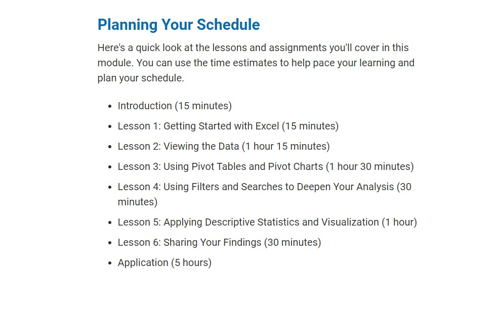

Module 1: Kickstaring with Excel:

Day_1 will cover Module 1 from **1.0.1 Excelling with Excel** through **1.4.2 VLOOKUP**.
We will cover the following concepts, techniques and task as part of Day_1 (Tuesday):
* Downloading and installing Excel
* Downloading the StarterBook.xlsx for the module.
* Filtering, formatting, and freezing specific columns and rows in Excel.
* Adding conditional formatting to columns
* Finding averages
* Debugging errors
* Using pivot tables and creating charts
* Filtering a data set using VLOOKUP()

Day_2 will cover Module 1 from **1.5.2 Measures of Central Tendency** through **1.6.1 GitHub**.
We will cover the follding concepts, techniques and task as part of Day_2 (Thursday)
* Determine the measures of central tendency: mean, median, and mode.
* Determine the measures of spread: range, variance, standard deviation, and quartiles.
* Visualize the distribution of data using Box Plots. 
* Using and adding files to a GitHub repository.

