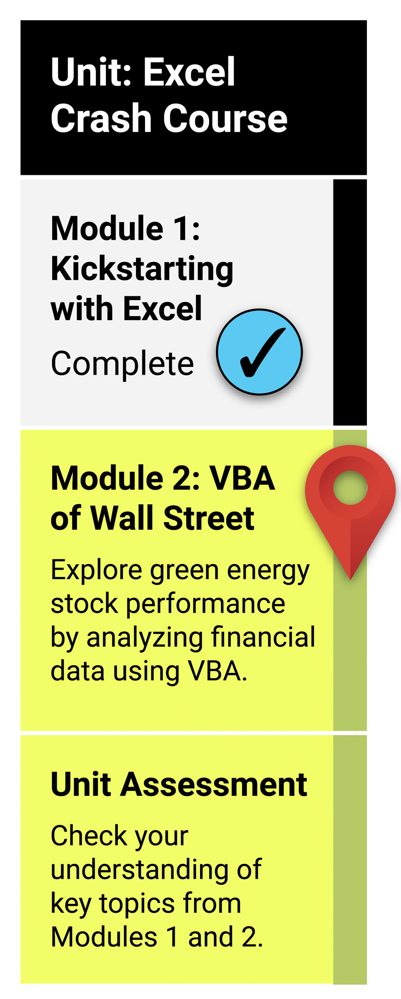

# What You Will Learn
### By the end of this module, you will be able to:

* Create a VBA macro that can trigger pop-ups and inputs, read and change cell values, and format cells.
* Use for loops and conditionals to direct logic flow.
* Use nested for loops.
* Apply coding skills such as syntax recollection, pattern recognition, problem decomposition, and debugging.

# Planning Your Schedule
### Here's a quick look at the lessons and assignments you'll cover in this module. You can use the time estimates to help pace your learning and plan your schedule.

* Introduction to VBA (15 minutes)
* Become an Excel Developer with VBA (1 hour)
* Analyze Stock Data with VBA (2 hours)
* Analyze Multiple Stocks (2 hours)
* Make the Worksheet Readable (2 hours)
* Make the Worksheet Interactive (1 hour 15 minutes)
* Application (5 hours)