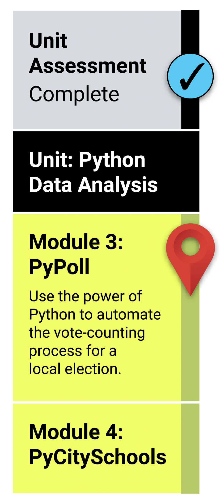

# What You Will Learn
### By the end of this module, you should be able to:

* Navigate to folders on your computer using the command line.
* Read and extract data from CSV files.
* Determine the difference between Python data types, like integers, floating-point decimal numbers, and strings.
* Perform mathematical operations using data types.
* Declare variables using different data types.
* Create and use data structures like lists, tuples, and dictionaries.
* Create and use decision and repetition statements.
* Create and use Boolean and logical operators.
* Write data to an output file and print the file.

# Planning Your Schedule
### Here's a quick look at the lessons and assignments you'll cover in this module. You can use the time estimates to help pace your learning and plan your schedule.

* Introduction to Module 3 (15 minutes)
* Get Started with the Command Line and Python (1 hour)
* Python Practice (3 hours)
* Open the Election Results (30 minutes)
* Get Started with File Processing (3 hours)
* Analyze the Election Data (2 hours)
* Finalize the Election Results (1 hour)
* Application (5 hours)

[3-1-Student-Resources.zip](https://2u-data-curriculum-team.s3.amazonaws.com/data-viz-online-lesson-plans/03-Lessons/3-1-Student-Resources.zip)

[3-2-Student-Resources.zip](https://2u-data-curriculum-team.s3.amazonaws.com/data-viz-online-lesson-plans/03-Lessons/3-2-Student-Resources.zip)
