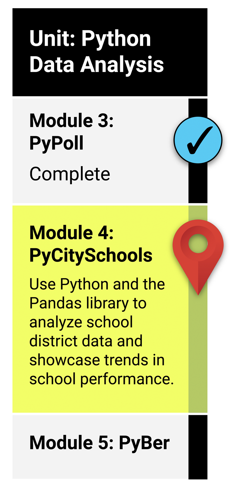

# What You Will Learn
### By the end of this module, you should be able to:

* Open Jupyter Notebook files from local directories using a development environment.
* Read an external CSV file into a DataFrame.
* Format a DataFrame column.
* Determine data types of row values in a DataFrame.
* Retrieve data from specific columns of a DataFrame.
* Merge, filter, slice, and sort a DataFrame.
* Apply the groupby() function to a DataFrame.
* Use multiple methods to perform a function on a DataFrame.
* Perform mathematical calculations on columns of a DataFrame or Series.

# Planning Your Schedule
### Here's a quick look at the lessons and assignments you'll cover in this module. You can use the time estimates to help pace your learning and plan your schedule.

* Introduction to Module 4 (30 minutes)
* Anaconda Installation and Jupyter Notebook (1 hour)
* Creating and Activating A Development Environment (30 minutes)
* Working with Jupyter Notebook and Pandas (1 hour 30 minutes)
* Convert CSV Files to a Pandas DataFrame (1 hour)
* Exploring the Data (1 hour 30 minutes)
* Verify the Clean Student Data (15 minutes)
* Generate the School District Summary (1 hour 30 minutes)
* Generate the School Summary (1 hour 30 minutes)
* High and Low Performing Schools (1 hour)
* Average Math and Reading Scores by Grade (1 hour)
* Group Scores by School Spending per Student(1 hour)
* Group Scores by School Size (1 hour)
* Group Scores by School Type (30 minutes)
* Application (5 hours)

[4-1-Student-Resources.zip](https://2u-data-curriculum-team.s3.amazonaws.com/data-viz-online-lesson-plans/04-Lessons/4-1-Student-Resources.zip)

[4-2-Student-Resources.zip](https://2u-data-curriculum-team.s3.amazonaws.com/data-viz-online-lesson-plans/04-Lessons/4-2-Student-Resources.zip)
