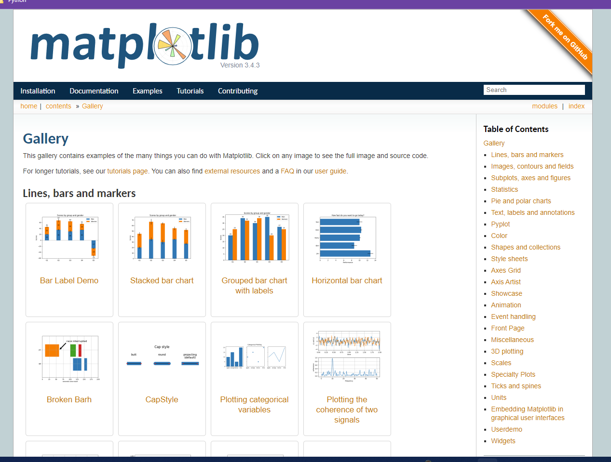

# Day_2 Matplotlib
## Overview
 The main focus of today's class is graphing data from DataFrames. IN today’s activities you will perform data munging tasks such as using value_counts(), groupby() with count(), mean(), and sum(), and the loc[] method to filter data before they create charts. You will also be introduced to the pivot() and resample() functions, which will help them with the Challenge. The resample() function can order the time series data by hour, day, week, month, or year depending on the desired output to showcase the data in a chart.

## Learning Objectives
By the end of class, students will be able to:

* Create line, bar, pie, and scatter charts from Pandas DataFrames
* Add and modify chart features

## Where can you find information on the tasks covered in this Day_1 of Matplotlib?
  * Plotting Pandas DataFrames and Series was covered in **Lesson 5.1.10**.
  * The `groupby()` function was covered in the previous module. 
  * The `pivot()` and `resample()`functions were covered in the **06-Evr_BikeTrippin-Pivot_Resample** activity and will be needed to complete the Challenge.

## Other Resources:

[matplotlib gallery, tutorials, examples and documentation](https://matplotlib.org/stable/gallery/index.html)

[Python Data Science Handbook Chapter 4: Visualization with Matplotlib](https://jakevdp.github.io/PythonDataScienceHandbook/04.00-introduction-to-matplotlib.html)