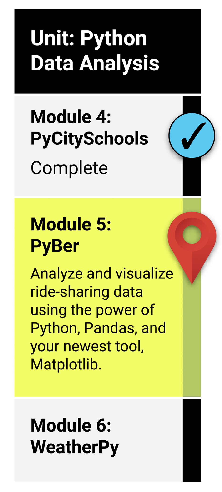

# Matplotlib

## What You Will Learn
By the end of this module, you will be able to: 

* Create line, bar, scatter, bubble, pie, and box-and-whisker plots using Matplotlib.
* Add and modify features of Matplotlib charts.
* Add error bars to line and bar charts.
* Determine mean, median, and mode using Pandas, NumPy, and SciPy statistics.

## Planning Your Schedule
Here's a quick look at the lessons and assignments you'll cover in this module. You can use the time estimates to help pace your learning and plan your schedule.

* Welcome to Module 5 (30 minutes)
* Create Visualizations Using Matplotlib (3 hours)
* Convert CSV Files to Pandas DataFrames (1 hour)
* Create a Bubble Chart for Ride-Sharing Data (3 hours)
* Calculate Summary Statistics (2 hours)
* Pie Chart: Percentage of Total Fares by City Type (1 hour)
* Pie Chart: Percentage of Total Rides by City Type (1 hour)
* Pie Chart: Percentage of Total Drivers by City Type (1 hour)
* Application (5 hours)

## Other Resources

[matplotlib gallery, tutorials, examples and documentation](https://matplotlib.org/stable/)