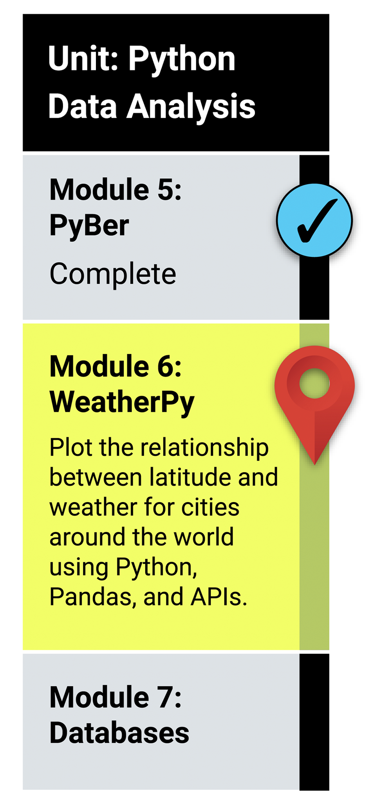

# APIs

In this module, you'll practice your analysis, visualization, and statistical skills by retrieving and analyzing weather data for a hypothetical travel company, PlanMyTrip. Successfully completing the tasks will draw on your knowledge of Python, decision and repetition statements, data structures, Pandas, Matplotlib, and SciPy statistics.

## What You Will Learn
By the end of this module, you will be able to: 

* Perform tasks using new Python libraries and modules.
* Retrieve and use data from an API "get" request to a server.
* Retrieve and store values from a JSON array.
* Use try and except blocks to resolve errors.
* Write Python functions.
* Create scatter plots using the Matplotlib library, and apply styles and features to a plot.
* Perform linear regression, and add regression lines to scatter plots.
* Create heatmaps, and add markers using the Google Maps API.

## Planning Your Schedule
Here's a quick look at the lessons and assignments you'll cover in this module. You can use the time estimates to help pace your learning and plan your schedule.

* Introduction to Module 6 (1 hour)
* Generate Random Coordinates of World Cities (1–2 hours)
* Retrieve, Collect, and Clean Weather Data (1–2 hours)
* Plot Weather Data (1–2 hours)
* Determine Correlations (2–3 hours)
* Use a Google API to Create Heatmaps (2–3 hours)
* Application (5 hours)
