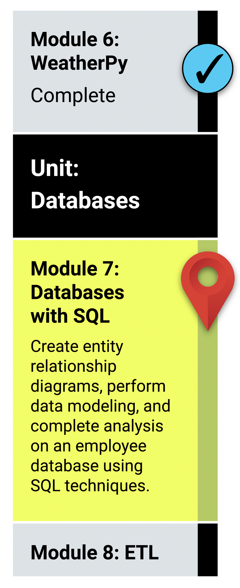

# Module 7 Class 1: Getting Started with pgAdmin and SQL

## Learning Objectives

By the end of class, you will be able to:
 
* Verify that PostgreSQL and pgAdmin are installed correctly
* Create a database
* Import CSVs into database tables
* Perform simple queries
* Combine data using joins

## How does this tie into the modules?
The activities in this class will complement Lessons **7.0.1: Exploring Databases with SQL** through **7.3.3: Joins in Action**.  You will benefit from these activities if they‘ve progressed through these lessons, which cover the following concepts, techniques, and tasks:  

* Create an ERD from CSV files
* Create a database on pgAdmin
* Create tables in a database using the ERD
* Import CSV files into database tables
* Create and run queries
* Use joins to combine records from two or more tables
* Create a new table from a query
* Export data from a table into a CSV file

## Where in the modules can I go for assistance?

  * Creating a database was covered in **Lesson 7.2.1**.
  * Creating tables in a database was covered in **Lesson 7.2.2**.
  * Importing data into tables was covered in **Lesson 7.2.3**.
  * The `DROP TABLE` statement was covered in **Lesson 7.2.4** and **Lesson 7.3.2**.
  * The `SELECT` statement was covered in **Lesson 7.3.1**.
  * Creating a new table from a query was covered in **Lesson 7.3.1**.
  * The `WHERE` clause was covered in **Lesson 7.3.1**.
  * Using joins was covered in **Lesson 7.3.3**.

## Additional References
[postgresql joins](https://www.techonthenet.com/postgresql/joins.php)
