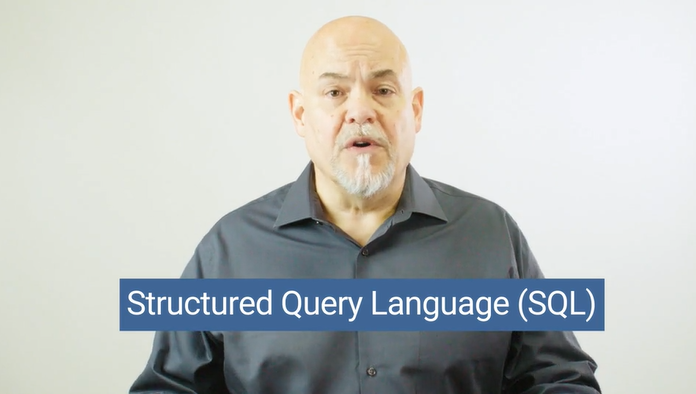

# Module 9 - SQL

## Objectives

* Create a localhost connection to a PostgreSQL server and have successfully connect to it.
* Create, use, and populate a SQL database with data.
* Create, populate, and select data from a SQL table.
* Import large CSV datasets into pgAdmin.
* Use pgAdmin to select specific rows/columns of data out from a table.
* Understand the different kinds of joins and how to use them to create new tables in pgAdmin.
* Solidify the foundations of writing basic- to intermediate-level SQL statements.
* Develop an introductory understanding of table design and database management.

## Planning Your Schedule (15 - 20 hours Outside the Virtual Classroom)
Here's a quick look at the lessons and assignments you'll cover in this module. You can use the time estimates to help pace your learning and plan your schedule.

* Introduction to SQL (15 minutes)
* Getting Started with PostgreSQL and pgAdmin (45 minutes)
* Data Modeling (1 hour)
* Data Engineering (3 hours)
* Data Analysis (4 hours)
* Application (5 hours)

## Additional Resources

* [PostgreSQL Documentation](https://www.postgresql.org/docs/manuals/)

* [pgAdmin Documentation](https://www.pgadmin.org/docs/)

* [PostgreSQL Tutorial](https://www.tutorialspoint.com/postgresql/)

- - -

© 2020 Trilogy Education Services, LLC, a 2U, Inc. brand.  Confidential and Proprietary.  All Rights Reserved.