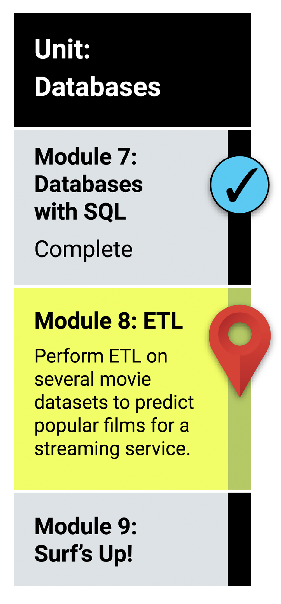

# Module 8 Class 2: Regular Expressions

## Learning Objectives

By the end of class, you will be able to:

* Use sets, wildcards, and escaping in their regular expressions
* Use special characters to grab text from the beginning and end of a text search in regular expressions
* Group their regular expressions to grab more information from their regular expression results
* Combine regular expressions and functions to make their searches more reusable.

## How does this tie into the modules?
The activities in this class will complement Lessons **8.3.9: Write Regular Expressions** through **8.3.12: Clean the Kaggle Data**.  You will benefit from these activities if they‘ve progressed through these lessons, which cover the following concepts, techniques, and tasks:

 * Character types, sets, matching, and escaping with regular expressions
 * Grouping with regular expressions
 * Character counting
 * Chain methods and functions

# Where in the modules can I go for assistance?
* Before ending class, review the skills that were covered today and mention where in the module these skills are used.
 * Using regular expressions with sets, wildcards, and escaping was covered in **Lesson 8.3.9**.
 * Using regular expressions with special characters was covered in **Lesson 8.3.9**.
 * Using regular expressions with grouping was covered in **Lesson 8.3.9**.
 * Combining the use of regular expressions and functions was covered in **Lesson 8.3.10**.
