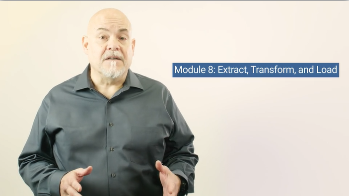

# Module 8 - Etract, Transform, Load (ETL)

## Overview
This week, we will be introducing the Extract, Transform, Load (ETL) process. In this unit, you will learn to use Python functions, list comprehensions, and regular expressions, as well as how to move data through a pipeline.

## Objectives

* Create functions to avoid repeated code.
* Create lambda functions and use them to replace regular functions.
* Expand on list comprehensions by adding in conditional statements.
* Use basic regular expressions to pull apart certain text.
* Use sets, wildcards, and escaping in their regular expressions
* Use special characters to grab text from the beginning and end of a text search in regular expressions
* Group their regular expressions to grab more information from their regular expression results
* Combine regular expressions and functions to make their searches more reusable.

## Planning Your Schedule (15 - 20 hours Outside the Virtual Classroom)
Here's a quick look at the lessons and assignments you'll cover in this module. You can use the time estimates to help pace your learning and plan your schedule.

* Introduction (15 minutes)
* Getting Started with ETL (15 minutes)
* Overview of the ETL Process (30 minutes)
* Extract the Data (45 minutes)
* Transform: Clean Individual Datasets (7 hours)
* Transform: Merge Datasets (2 hours)
* Load (1 hour, 30 minutes)
* Application (5 hours)