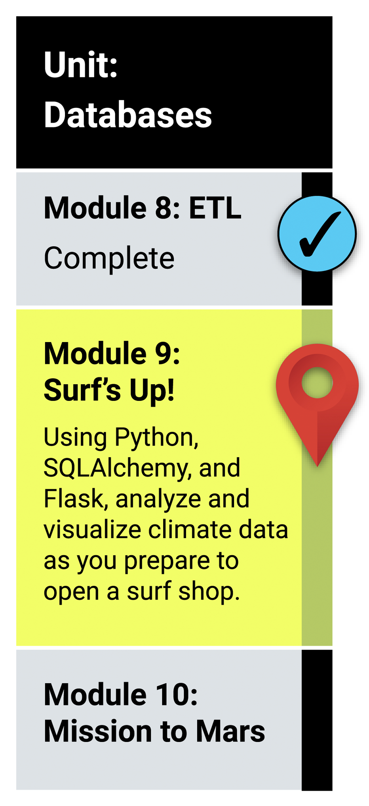

# Module 9 Class 1: Querying Databases with SQLAlchemy

## Learning Objectives

By the end of class, students will be able to:

* Connect to a SQLite database using SQLAlchemy
* Perform basic SQL queries using `engine.execute()`
* Reflect existing databases
* Use the SQLAlchemy Inspector to view table names and metadata in the SQLite file
* Plot the query results from the SQLAlchemy object relational mapper (ORM)

## How does this tie into the modules?
The activities in this class will complement **Lessons 9.0.1: Exploring Databases with SQL through 9.3.4: Plot the Highest Number of Observations**. The students will benefit from these activities if they‘ve progressed through these lessons, which cover the following concepts, techniques, and tasks:

* Connect to a SQLite database using the `create.engine()` function
* Create classes using the `automap_base()` function
* Retrieve the table schema using the `prepare()` function
* Access database classes or tables with `Base.classes`
* Retrieve the table information using `Base.classes.keys()`
* Create a session to a database using `Session(engine)`
* Write SQL queries to use aggregate functions, filter, and retrieve data from a table 
* Save a SQLAlchemy query to a Pandas DataFrame 

# Where in the modules can I go for assistance?
  * Connecting to a database using `create_engine` and `session`, and reflecting the data were covered in **Lesson 9.1.5**.
  * The `query()` method on the `session` object was covered in **Lesson 9.1.5**.
  * The difference in time using `timedelta` was covered in **Lesson 9.2.1**.