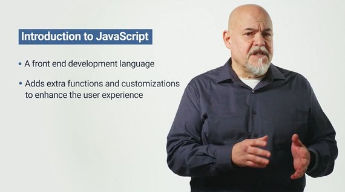
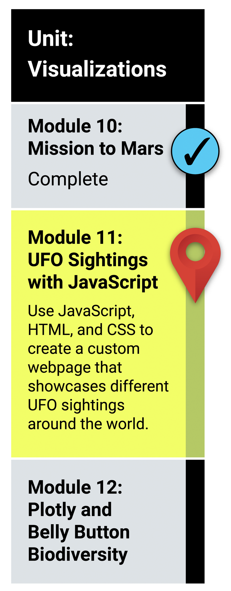

# Unit 14 - Intro to Javascript

## What You Will Learn

* Explain the strengths and weaknesses of JavaScript "standard" and JavaScript version ES6+.
* Describe JavaScript syntax and ideal use cases.
* Build and deploy JavaScript functions, including built-in functions.
* Convert JavaScript functions to arrow functions.
* Build and deploy forEach (JavaScript for loop).
* Create, populate, and dynamically filter a table using JavaScript and HTML

## Planning Your Schedule (15 - 20 hours Outside the Virtual Classroom)
Here's a quick look at the lessons and assignments you'll cover in this module. You can use the time estimates to help pace your learning and plan your schedule.

* Introduction to Module 11(15 mins)
* JavaScript Basics (1 hour)
* Building Webpages with JavaScript (1 hour)
* Functional JavaScript (1 hour)
* JavaScript for Loops (1 hour)
* Building Dynamic Tables (1 hour)
* Build the HTML (2 hours)
* Application (5 Hours)

- - -

### Links

* [W3 Schools JavaScript tutorial](https://www.w3schools.com/js/default.asp)

* [Interactive JavaScript Sheet](http://htmlcheatsheet.com/js/)

* [You Don't Know JS (book series)](https://github.com/getify/You-Dont-Know-JS)

---

© 2021 Trilogy Education Services, LLC, a 2U, Inc. brand.  Confidential and Proprietary.  All Rights Reserved.
