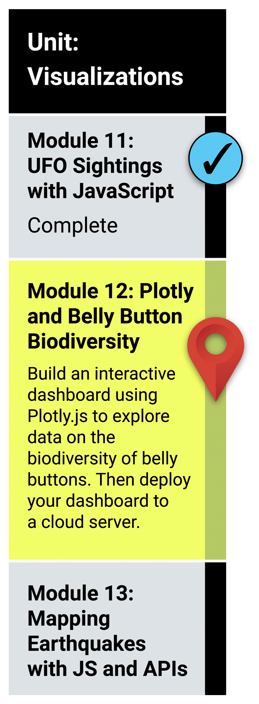

# Unit 12 - Intro to Plotly.js

## What You Will Learn
n this module, you will use Plotly.js, a JavaScript data visualization library, to create an interactive data visualization for the web. The completed work will be displayed in a portfolio you create.

To be successful in this module, you'll need to be familiar with HTML and basic JavaScript.

* Create basic plots with Plotly, including bar charts, line charts, and pie charts.
* Use D3.json() to fetch external data, such as CSV files and web APIs.
* Parse data in JSON format.
* Use functional programming in JavaScript to manipulate data.
* Use JavaScript's Math library to manipulate numbers.
* Use event handlers in JavaScript to add interactivity to a data visualization.
* How to use interactivity to enhance your visualizations.
* Deploy an interactive chart to GitHub Pages.

## Planning Your Schedule (15 - 20 hours Outside the Virtual Classroom)
Here's a quick look at the lessons and assignments you'll cover in this module. You can use the time estimates to help pace your learning and plan your schedule.

Introduction to Module 12 (15 mins)
Getting Started with Plotly (1 hour)
Transform Data with JavaScript (4 hours)
Retrieve External Data (4 hours)
JavaScript Events (3 hours)
Deployment (15 mins)
Application (5 hours)

- - -

### Links

* [Plotly.js Graphing Library](https://plotly.com/javascript/)

---

© 2021 Trilogy Education Services, LLC, a 2U, Inc. brand.  Confidential and Proprietary.  All Rights Reserved.
