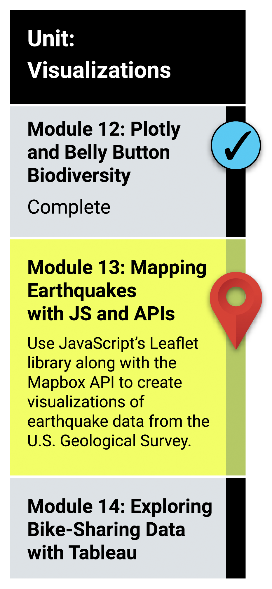

# Unit 13 Visualizing Earthquake Data using GeoJSON

## What You Will Learn
In this module, you will use the Leaflet.js Application Programming Interface (API) to populate a geographical map with GeoJSON earthquake data from a URL. Each earthquake will be visually represented by a circle and color, where a higher magnitude will have a larger diameter and will be darker in color. In addition, each earthquake will have a popup marker that, when clicked, will show the magnitude of the earthquake and the location of the earthquake.

To be successful in this module, you'll need to be familiar with HTML and basic JavaScript.

* Create a branch from the main branch on GitHub.
* Add, commit, and push data to a GitHub branch.
* Merge a branch with the main branch on GitHub.
* Retrieve data from a GeoJSON file.
* Make API requests to a server to host geographical maps.
* Populate geographical maps with GeoJSON data using JavaScript and the Data-Driven Documents (D3) library.
* Add multiple map layers to geographical maps using Leaflet control plugins to add user interface controls.
* Use JavaScript ES6 functions to add GeoJSON data, features, and interactivity to maps.
* Render maps on a local server.

## Planning Your Schedule (15 - 20 hours Outside the Virtual Classroom)
Here's a quick look at the lessons and assignments you'll cover in this module. You can use the time estimates to help pace your learning and plan your schedule.

* Introduction to Module 13 (15 minutes)
* The Earthquake Mapping Project (30 minutes)
* Create Your First Map (1 hour)
* Don't Mess with the main Branch (1 hour)
* Map Geographical Features (2 hours)
* Map GeoJSON Data (2 hours)
* Map Earthquakes (2 hours)
* Application (5 hours)

- - -

### Links
* [mapbox.com](https://www.mapbox.com/)
  
* [leafletjs.com](https://leafletjs.com/index.html)

* [github Docs](https://docs.github.com/en)

---

© 2021 Trilogy Education Services, LLC, a 2U, Inc. brand.  Confidential and Proprietary.  All Rights Reserved.
