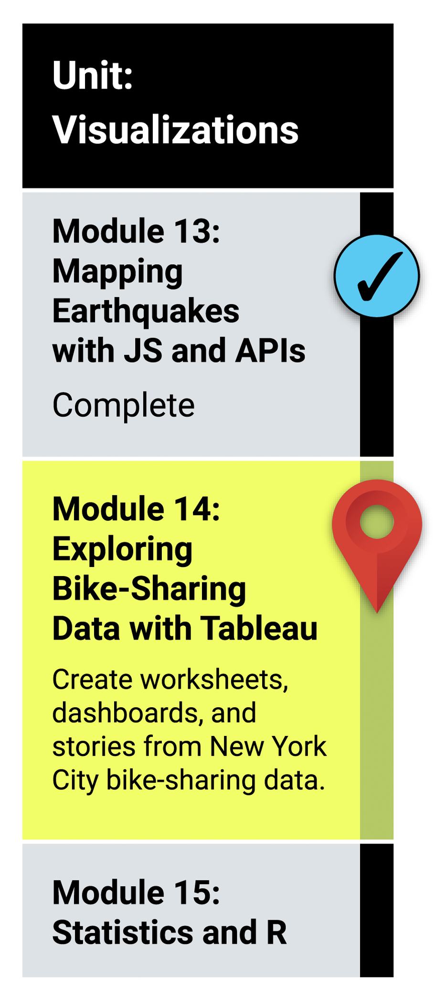

# Module 14 : Creating Visualizations with Tableau

## What You Will Learn
This week, we will be learning how to visualize data stories with Tableau. In this unit, you will learn how to import data into Tableau, create basic visualizations, change data types of columns, join data sources, customize visualizations, create calculated fields, and create dashboards and stories.

* Import data into Tableau.
* Create and style worksheets, dashboards, and stories in Tableau.
* Use Tableau worksheets to display data in a professional way.
* Portray data accurately using Tableau dashboards.

## Planning Your Schedule (15 - 20 hours Outside the Virtual Classroom)
Here's a quick look at the lessons and assignments you'll cover in this module. You can use the time estimates to help pace your learning and plan your schedule.

* Introduction to Module 14 (15 minutes)
* Tableau Basics (1 hour)
* Tableau Worksheets, Part 1 (1 hour)
* Tableau Worksheets, Part 2 (2 hours)
* Tableau Dashboards (1 hour)
* Final Presentation (1 hour)
* Challenge (5 hours)

- - -

### Links
* [Tableau Public signup](https://public.tableau.com/en-us/s/)

* [Newest Releases of Tableau Public](https://www.tableau.com/support/releases)

* [Tableau Example Connections Overview](https://help.tableau.com/current/pro/desktop/en-us/exampleconnections_overview.htm)

* [CitiBike New York System Data Page](https://ride.citibikenyc.com/system-data)

* [Tableau Dashboards Best Practices](https://help.tableau.com/current/pro/desktop/en-us/dashboards_best_practices.htm)

* [Tableau Public Viz of the Day](https://public.tableau.com/app/discover/viz-of-the-day)

* [Tableau Support](https://www.tableau.com/support)

* [Tableau Search Tips](https://www.tableau.com/support/site-search-tips)

* [Tableau Tips for making your dashboards more performant](https://www.tableau.com/about/blog/2016/1/5-tips-make-your-dashboards-more-performant-48574)

---

© 2021 Trilogy Education Services, LLC, a 2U, Inc. brand.  Confidential and Proprietary.  All Rights Reserved.
