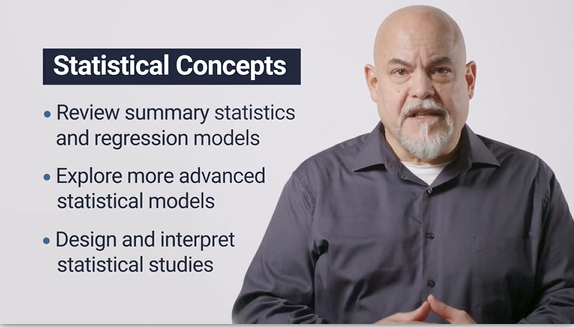
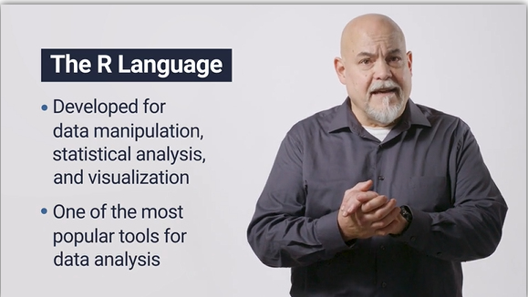
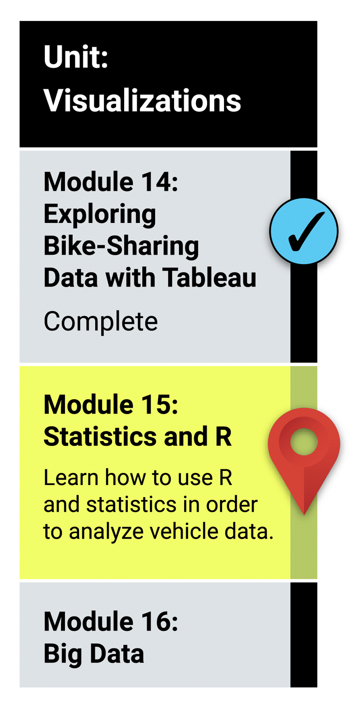

# Module 15: The Fundamentals of R

## What You Will Learn
By the end of this module, you will be able to: 

* Load, clean up, and reshape datasets using tidyverse in R.Visualize datasets with basic plots such as line, bar, and scatter plots using ggplot2.
* Generate and interpret more complex plots such as boxplots and heatmaps using ggplot2.
* Plot and identify distribution characteristics of a given dataset.
* Formulate null and alternative hypothesis tests for a given data problem.
* Implement and evaluate simple linear regression and multiple linear regression models for a given dataset.
* Implement and evaluate the one-sample t-Tests, two-sample t-Tests, and analysis of variance (ANOVA) models for a given dataset.
* Implement and evaluate a chi-squared test for a given dataset.
* Identify key characteristics of A/B and A/A testing.
* Determine the most appropriate statistical test for a given hypothesis and dataset.

## Planning Your Schedule (15 - 20 hours Outside the Virtual Classroom)
Here's a quick look at the lessons and assignments you'll cover in this module. You can use the time estimates to help pace your learning and plan your schedule.

* Introduction to Module 15 (15 minutes)
* Getting Started with R (30 minutes)
* Programming and ETL in R (2 hours)
* Visualize Your Data Using ggplot2 (2 hours)
* Introduction to Statistical Tests (1 hour)
* Introduction to Hypothesis Testing (30 minutes)
* Perform an Analysis of Means in R (1 hour)
* Correlation and Regression in R (1 hour)
* Characterize Categorical Data (30 minutes)
* Getting Real with A/B Testing (15 minutes)
* Choose the Right Test for Your Data (15 minutes)
* Application (5 hours)

- - -

### Links
* [R Introduction documentation](https://courses.bootcampspot.com/courses/941/pages/15-dot-2-1-fundamentals-of-r-programming?module_item_id=344077)

* [W3 Schools R Tutorial](https://www.w3schools.com/r/default.asp)

* [R Graphics Cookbook](http://www.cookbook-r.com/)

* [tidyverse](https://www.tidyverse.org/)

  - [dplyr](https://dplyr.tidyverse.org/)

  - [ggplot](https://ggplot2.tidyverse.org/)

---

© 2021 Trilogy Education Services, LLC, a 2U, Inc. brand.  Confidential and Proprietary.  All Rights Reserved.
