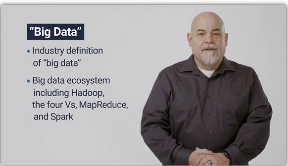
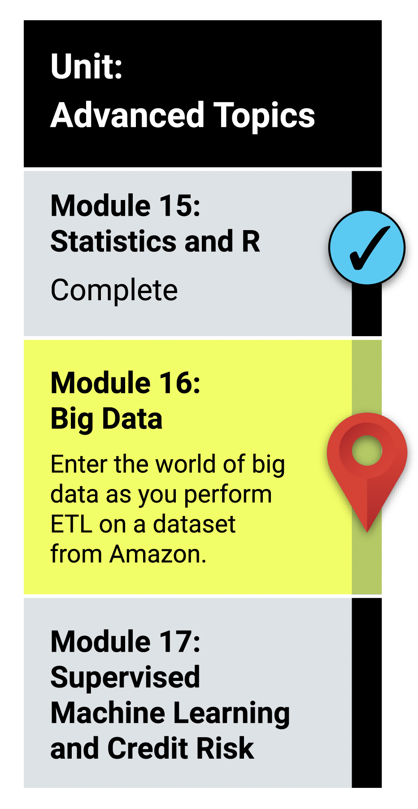

# Module 16: Big Data

## What You Will Learn
By the end of this module, you will be able to:

* Define big data and describe the challenges associated with it.
* Define Hadoop and name the main elements of its ecosystem.
* Explain how MapReduce processes data.
* Define Spark and explain how it processes data.
* Describe how NLP collects and analyzes text data.
* Explain how to use AWS Simple Storage Service (S3) and relational databases for basic cloud storage.
* Complete an analysis of an Amazon customer review.

## Planning Your Schedule (15 - 20 hours Outside the Virtual Classroom)
Here's a quick look at the lessons and assignments you'll cover in this module. You can use the time estimates to help pace your learning and plan your schedule.

* Introduction to Module 16 (15 minutes)
* Overview of Big Data (15 minutes)
* Using MapReduce to Process Data (30 minutes)
* Using Spark to Handle Large Datasets (30 minutes)
* Working with Spark DataFrames and Functions (2 hours)
* Natural Language Processing (1 hour)
* PySpark and Natural Language Processing (2 hours)
* Cloud Databases with Amazon Web Services (2 hours)
* Cloud Storage with S3 on AWS (2 hours)
* ETL in the Cloud (2 hours)
* Application (5 hours)

- - -

### Links

* [Apache Hadoop Project ](https://hadoop.apache.org/)

* [Map Reduce](https://mrjob.readthedocs.io/en/latest/)

* [Apache Spark](https://spark.apache.org/)

* [Google Colaboratory](https://colab.research.google.com/notebooks/welcome.ipynb)

* [AWS Free Tier](https://aws.amazon.com/free/?all-free-tier.sort-by=item.additionalFields.SortRank&all-free-tier.sort-order=asc&awsf.Free%20Tier%20Types=*all&awsf.Free%20Tier%20Categories=*all)

---

© 2021 Trilogy Education Services, LLC, a 2U, Inc. brand.  Confidential and Proprietary.  All Rights Reserved.
