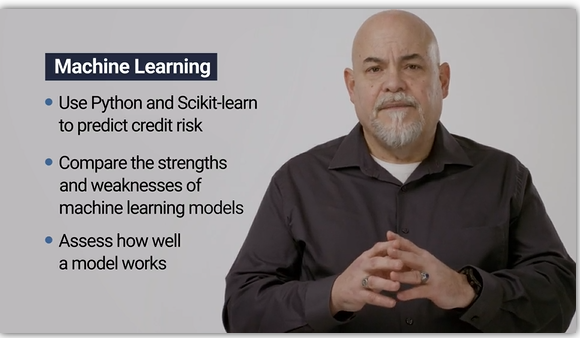
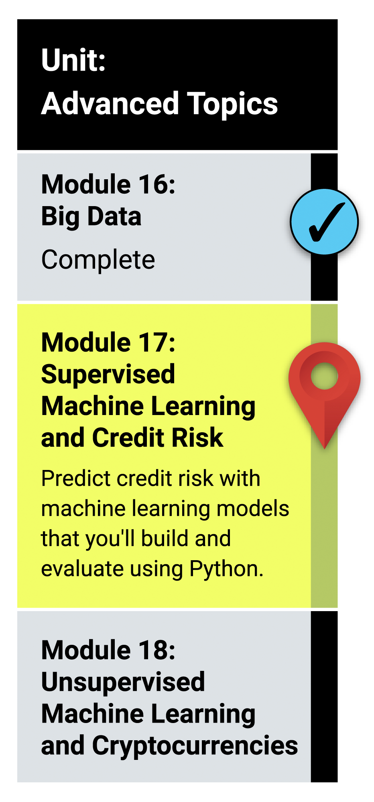

# Module 17: Supervised Machine Learning

## What You Will Learn
By the end of this module, you will be able to:

* Explain how a machine learning algorithm is used in data analytics.
* Create training and test groups from a given data set.
* Implement the logistic regression, decision tree, random forest, and support vector machine algorithms.
* Interpret the results of the logistic regression, decision tree, random forest, and support vector machine algorithms.
* Compare the advantages and disadvantages of each supervised learning algorithm.
* Determine which supervised learning algorithm is best used for a given data set or scenario.
* Use ensemble and resampling techniques to improve model performance.
  
## Planning Your Schedule (15 - 20 hours Outside the Virtual Classroom)
Here's a quick look at the lessons and assignments you'll cover in this module. You can use the time estimates to help pace your learning and plan your schedule.

* Introduction to Module 17 (15 minutes)
* Machine Learning Environment (30 minutes)
* Supervised Learning (1 hour)
* Logistic Regression (1 hour)
* Classification Model Validation (1 hour)
* Support Vector Machines (1 hour)
* Data Preprocessing in Machine Learning (1 hour)
* Decision Trees (1 hour)
* Ensemble Learning and Random Forests (1 hour)
* Bagging and Boosting (2 hours)
*Techniques to Resolve Class Imbalance (2 hours)
* Application (5 hours)

- - -

### Links

[Scikit-Learn](https://scikit-learn.org/stable/)

---

© 2021 Trilogy Education Services, LLC, a 2U, Inc. brand.  Confidential and Proprietary.  All Rights Reserved.
