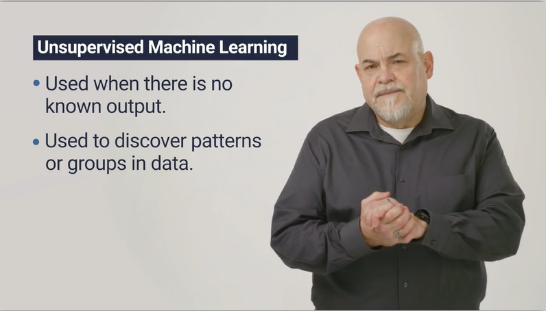
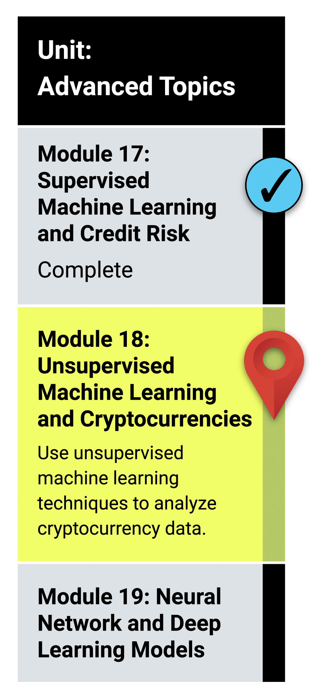

# Module 18: Unsupervised Machine Learning

## What You Will Learn
By the end of this module, you will be able to:

* Describe the differences between supervised and unsupervised learning, including real-world examples of each.
* Preprocess data for unsupervised learning.
* Cluster data using the K-means algorithm.
* Determine the best number of centroids for K-means using the elbow curve.
* Use PCA to limit features and speed up the model.
  
## Planning Your Schedule (15 - 20 hours Outside the Virtual Classroom)
Here's a quick look at the lessons and assignments you'll cover in this module. You can use the time estimates to help pace your learning and plan your schedule.

* Introduction to Module 18 (15 minutes)
* Supervised vs. Unsupervised Learning (1 hour)
* Data Preprocessing (2 hour)
* Clustering and the K-means Algorithm (1 hour)
* Using the Elbow Curve to Find Centroids (1 hour)
* Managing Data Features (2 hour)
* Hierarchical Clustering (2 hour)
* Application (5 hours)

- - -

### Links

[Scikit-learn](https://scikit-learn.org/stable/)

[Plotly Python](https://plotly.com/python/)

[hvPlot](https://hvplot.holoviz.org/)

---

© 2021 Trilogy Education Services, LLC, a 2U, Inc. brand.  Confidential and Proprietary.  All Rights Reserved.
