# Module 19 Class 2: Applying Advanced Machine Learning to Real Data

## Overview

Before class, walk through this week's Challenge assignment in office hours; then, in class, the students will practice adding more hidden layers and using different activation functions to increase the performance of a neural network. Then, they’ll apply a deep learning model on a real dataset, where they’ll preprocess, fit, transform, and split the data. Finally, they’ll train the model with more than one hidden layer and node, and then they’ll evaluate the model’s performance.  

## Learning Objectives

By the end of class, students will be able to:

* Understand the differences between basic neural networks, deep learning, and other machine learning models
* Increase the performance of a neural network 
* Apply deep learning to a dataset 

- - -

## Instructor Notes

The activities in this class will complement Lessons **19.2.5: Create the Connective Tissue, the Multiple-Neuron Neural Network** through **19.6.2: For Best Results, Please Save After Training**. The students will benefit from these activities if they‘ve progressed through these lessons, which cover the following concepts, techniques, and tasks:  

* Adding more hidden layers to a basic neural network
* Increasing a model’s performance using activation functions 
* Practicing using one-hot encoding and data cleaning on a real dataset
* Applying deep learning to a dataset using the machine learning model workflow
* Adding a model checkpoint to save your model weights and resume training later
* Comparing basic neural networks and deep learning models to other machine learning models


## Slides

[Neural Networks and Deep Learning  Day 2 slideshow](https://docs.google.com/presentation/d/1o-4oR6SMRG2gN0wFHo5XwS5w8VkbSDkwyjRrKwf2eyY/edit?usp=sharing)

## Student Resources

If students were unable to download today's [activity resources](https://2u-data-curriculum-team.s3.amazonaws.com/data-viz-online-lesson-plans/19-Lessons/19-2-Student_Resources.zip) from Canvas, please share them with the students.

- - - 

## Before Class

### 0. Office Hours

| Activity Time: 0:30       |  Elapsed Time:     -0:30  |
|---------------------------|---------------------------|

<details>
  <summary><strong>📣 Instructor Do: Challenge Instruction Walkthrough</strong></summary>

Let the students know that the first few minutes of Office Hours will include a walkthrough of the Challenge requirements and rubric, as well as helpful tips they need in order to be successful.

Open the Challenge in Canvas and go through the high-level instructions and requirements with your class. Be sure to check for understanding.

Open the Rubric in Canvas, go through the Mastery column with your class, and show how it maps back to the requirements for each deliverable. Be sure to check for understanding.

Let them know that this challenge has **four deliverables**. For the first three, they'll analyze, clean, and preprocess a dataset using Pandas; then, they’ll select, design, and train a binary classification model, and, finally, they'll optimize the model by modifying the input data and training to achieve greater than 75% accuracy. For the last deliverable, they'll write a report on the results of optimizing the deep learning model to achieve greater than 75% accuracy.  

The first deliverable, **Deliverable 1: Data Preprocessing for a Neural Network Model** requires the learners to preprocess the charity dataset in order to design a neural network of deep learning models in Deliverable 2.

To complete this deliverable, they'll need to use Pandas in a similar manner to what they were shown in the  module, doing the following:
* Dropping columns.
* Getting the unique values in each column.
* Determining the number of data points for each unique value.
* Creating density plots to determine the distribution of the column values.
* Using the density plots to create a cutoff point to bin "rare" categorical variables and bin values in columns that have rare occurrences.
* Generating a list of categorical variables.
* Encoding categorical variables using one-hot encoding.
* Merge the one-hot encoding DataFrame with the original DataFrame, then drop the originals.

We have provided the [AlphabetSoupCharity starter code](../../../01-Assignments/19-Neural_Network_and_Deep_Learning/Resources/AlphabetSoupCharity_starter_code.ipynb) to assist the students. However, they'll have to identify the target and features for their model before they begin the preprocessing steps. Once they have done this, then they'll need to add code to the empty input cells to get the output shown. 

For the second deliverable, **Deliverable 2: Compile, Train and Evaluate the Model**, they'll design a neural network or deep learning model to create a binary classification model that can predict if an Alphabet Soup&ndash;funded organization will be successful based on the features in the dataset.

The students should read and perform the steps in Lessons 19.4.4 and 19.4.5 to help them with this deliverable. Make sure they think about how many inputs there are before determining the number of neurons and layers to add to their model.

In addition, the students should look over the output cells in the [AlphabetSoupCharity starter code](../../../01-Assignments/19-Neural_Network_and_Deep_Learning/Resources/AlphabetSoupCharity_starter_code.ipynb) to glean any hints as to what code they should use in the input cell.

Don't forget to tell the students to be familiar with Lessons 19.6.1 and 19.6.2. They will need to create a callback that saves the model's weights every 5 epochs and save the results to a HDF5 file. 

For the third deliverable, **Deliverable 3: Optimize the Model**, the students will have to optimize the model in Deliverable 3 to achieve a target predictive accuracy greater than 75%. If they can't achieve greater than 75% accuracy, they'll need to show code that makes three attempts to optimize the model in their Jupyter Notebook file. 

**NOTE:** The accuracy for the solution after completing Deliverables 1 and 2&mdash;based on the requirements&mdash;is less than 75%, which was done on purpose so the students can learn to optimize the model for themselves. 

This part of the challenge may be the hardest for some learners as they'll have to use trial and error to optimize the model, which can take some time. They can use the suggestions we have provided in the instructions as well as the information in Lesson 19.2.6.  

For **Deliverable 4: A Written Report on the Neural Network Model**, the students will be writing a report in the repository README.md file based on the performance of the deep learning model they created for Alphabet Soup in Deliverable 3.

In the **Results** section, they'll need to answer the questions provided in the instructions using a bulleted list and images to support their answers.

In the **Summary** section, the students need to summarize the overall results of the deep learning model and recommend a different model that could solve this classification problem, and then provide justification as to why they chose that model. 

Encourage your class to begin the Challenge as soon as possible, if they haven’t already, and to use the Learning Assistants channel and the remainder of Office Hours with their instructional team for help as they progress through their work. If they feel like they need context to understand documentation or instructions throughout the week, this is where they can get it.

Open the floor to discussion and be sure to answer any questions they may have about the Challenge requirements before moving on to other areas of interest.

</details>

<details>
  <summary><strong>📣  Instructor Do: Office Hours</strong></summary>

For the remaining time, remind the students that this is their time to ask questions and get assistance from their instructional staff as they’re learning new concepts and working on the Challenge assignment.

Expect that students may ask for assistance with the following:

* Challenge assignment 
* Further review on a particular subject
* Debugging assistance
* Help with computer issues
* Guidance with a particular tool

</details>


- - - 

## During Class 

### 1. Getting Started

| Activity Time:       0:10 |  Elapsed Time:      0:10  |
|---------------------------|---------------------------|

<details>
  <summary><strong>📣 1.1 Instructor Do: Foundation Setting (0:05)</strong></summary>

* Welcome students to class.

* Before you get started, congratulate the students on finishing up the last week of machine learning and the last module of the course! Tell them to give themselves a huge round of applause on Zoom.

* Direct students to post individual questions in the Zoom chat to be addressed by you and your TAs at the end of class.

* Open the slideshow and use slides 1 - 6 to walk through the foundation setting with your class.

* **This Week - Neural Networks and Deep Learning:** Talk through the key skills that students will learn this week, and let them know that they are building on their knowledge of neural networks and machine learning.

* **Today's Objectives:** Now, outline the concepts covered in today's lesson. Remind students that they can find the relevant activity files in the “Getting Ready for Class” page in their course content. 

</details>

<details>
  <summary><strong>🎉 1.2 Everyone Do: Check-In (0:05)</strong></summary>

* Ask the class the following questions and call on students for the answers:

    * **Q:** How are you feeling about your progress so far?

    * **A:** We are building on our machine learning skills with neural networks and deep learning models. It's important to look back and see what we’ve accomplished, and acknowledge that it's a lot! It’s also okay to feel overwhelmed as long as you don’t give up. The more you practice, the more comfortable you'll be coding.
    
    * **Q:** How comfortable do you feel with this topic? 

    * **A:** Let's do "fist to five" together. If you are not feeling confident, hold up a fist (0). If you feel very confident, hold up an open hand (5).

</details>


- - -

### 2.  We Must Dig Deeper...Into Neural Networks

| Activity Time:       0:35 |  Elapsed Time:      0:45  |
|---------------------------|---------------------------|

<details>
  <summary><strong>🎉 2.1 Everyone Do: Over the Moon on Basic Neural Networks (0:05)</strong></summary>

* You can use slides 7 - 17 to assist you as you walk through this activity.

* Welcome students and let them know that in today's class, we will be looking at basic neural networks in more detail. We will explore the different parameters in a Sequential TensorFlow model as well as how to preprocess data for a neural network model.

* Mention that by the end of this class, we will be able to apply a neural network model to any real-world tabular dataset (data stored in a table).

* Start class by returning to the [TensorFlow Playground](https://playground.tensorflow.org/#activation=sigmoid&batchSize=10&dataset=gauss&regDataset=reg-plane&learningRate=0.03&regularizationRate=0&noise=0&networkShape=6&seed=0.16934&showTestData=false&discretize=false&percTrainData=50&x=true&y=true&xTimesY=false&xSquared=false&ySquared=false&cosX=false&sinX=false&cosY=false&sinY=false&collectStats=false&problem=classification&initZero=false&hideText=false).

* Remind the students that in the previous class, we built a basic neural network capable of accurately classifying a linearly separable dataset.

* Run the spiral dataset simulation for a few seconds, then pause the simulation.

* Point out that when our input data is not linearly separable, this same basic neural network model will struggle to classify our data points.

* Inform the students that in order for us to use more complex data, including real-world data, we will need to learn how to expand the capabilities of our neural network models.

* Let the students know that before we use a real-world dataset, we’ll do a warm-up activity where we’ll rebuild our basic neural network in Jupyter Notebook and apply it to a nonlinear dataset.

* Make sure the students can download and open the [01-Ins_OverTheMoon/Solved/Over_the_Moon_NN.ipynb](Activities/01-Ins_OverTheMoon/Solved/Over_the_Moon_NN.ipynb) file from the AWS link.

* Open up the [01-Ins_OverTheMoon/Solved/Over_the_Moon_NN.ipynb](Activities/01-Ins_OverTheMoon/Solved/Over_the_Moon_NN.ipynb) file in Jupyter Notebook.

* Run the first code block, and then show the students the plotted **moons dummy data**.

  ```python
  # Import our dependencies
  import pandas as pd
  import matplotlib as plt
  import sklearn as skl
  import tensorflow as tf
  from sklearn.datasets import make_moons

  # Creating dummy nonlinear data
  X_moons, y_moons = make_moons(n_samples=1000, noise=0.08, random_state=78)

  # Transforming y_moons to a vertical vector
  y_moons = y_moons.reshape(-1, 1)

  # Creating a DataFrame to plot the nonlinear dummy data
  df_moons = pd.DataFrame(X_moons, columns=["Feature 1", "Feature 2"])
  df_moons["Target"] = y_moons

  # Plot the nonlinear dummy data
  df_moons.plot.scatter(x="Feature 1",y="Feature 2", c="Target",colormap="winter")
  ```

  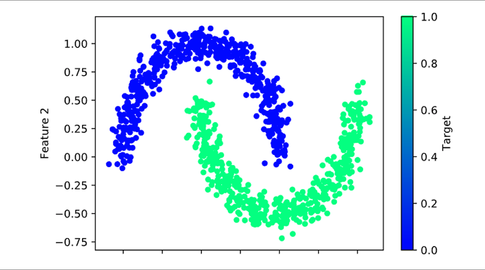

* Point out that similar to the swirl input data we saw in TensorFlow Playground, the moons dataset, made from scikit-learn's *make_moons* method, is not linearly separable.

* **Q:** Ask the students what the next steps are in the workflow. 

* **A:** We need to split the dataset, scale and standardize each feature, fit the model to our training data, transform the data, create a Sequential model, add the first layer and output layer, and then get the structure of the Sequential model. 

* Run the following code block to get the Sequential model summary:

  ```python
  # Use sklearn to split dataset
  from sklearn.model_selection import train_test_split
  X_train, X_test, y_train, y_test = train_test_split(X_moons, y_moons, random_state=78)

  # Create scaler instance
  X_scaler = skl.preprocessing.StandardScaler()

  # Fit the scaler
  X_scaler.fit(X_train)

  # Scale the data
  X_train_scaled = X_scaler.transform(X_train)
  X_test_scaled = X_scaler.transform(X_test)

  # Create the Keras Sequential model
  nn_model = tf.keras.models.Sequential()

  # Add our first Dense layer, including the input layer
  nn_model.add(tf.keras.layers.Dense(units=5, activation="relu", input_dim=2))

  # Add the output layer that uses a probability activation function
  nn_model.add(tf.keras.layers.Dense(units=1, activation="sigmoid"))

  # Check the structure of the Sequential model
  nn_model.summary()
  ```

  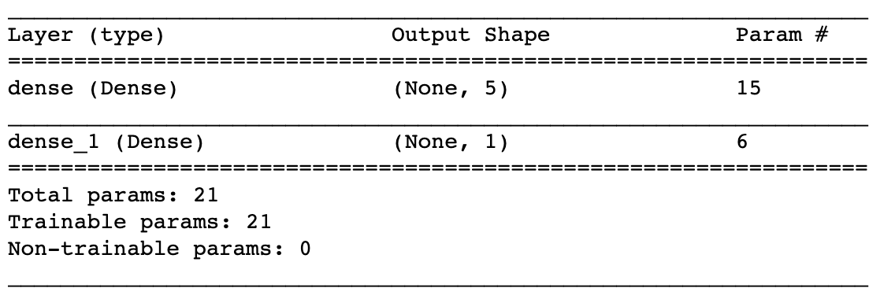

* Point out that these steps are exactly the same as the "Build Your Own Neural Network Model" activity we did in the previous class. 

* Next, we must compile and train our neural network model to classify between our two moon-shaped plotted samples.

* Run the following code block that compiles, trains, and evaluates the neural network model:

  ```python
  # Compile the Sequential model together and customize metrics
  nn_model.compile(loss="binary_crossentropy", optimizer="adam", metrics=["accuracy"])

  # Fit the model to the training data
  fit_model = nn_model.fit(X_train_scaled, y_train, epochs=100)

  # Evaluate the model using the test data
  model_loss, model_accuracy = nn_model.evaluate(X_test_scaled,y_test,verbose=2)
  print(f"Loss: {model_loss}, Accuracy: {model_accuracy}")
  ```

  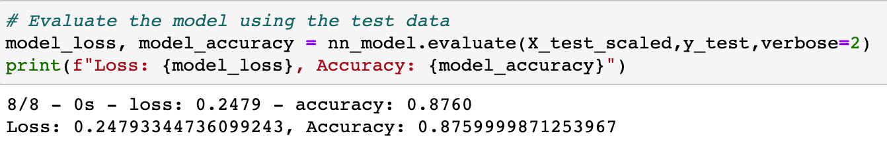

* Point out to the students that this time, our model **was not** able to accurately predict >90% of our training data.

  * **Note:** If your model is unable to achieve a predictive accuracy of >80%, try regenerating your model and retraining.

* Emphasize that depending on the dataset, or the use case for the model, a predictive accuracy of ~85% may be sufficient for a first-pass model.

  * For example, let's say we were trying to build a neural network that can predict if students are left-handed or right-handed. A model that was able to make correct predictions 85% of the time would be pretty accurate!

* Caution students that in many industrial and medical use cases, a machine learning model must exceed 95%, or even 99%, classification accuracy. In these cases, we would not accept the basic single-neuron, single-layer model.

* Point out that one possible solution to our performance problem is to add more neurons.

* Caution students that although adding more neurons is the most straightforward solution, it is not the most robust. Adding more neurons to a single hidden layer only boosts performance if there are subtle differences between values.

  * Run the neural network mode with 6 neurons and compare with the results above.

* Demonstrate that in our dataset, our two groups are separated by drawing a complex polynomial line. Therefore, a single-layer, multiple-neuron model would still struggle to adequately classify our two groups with only two inputs.

  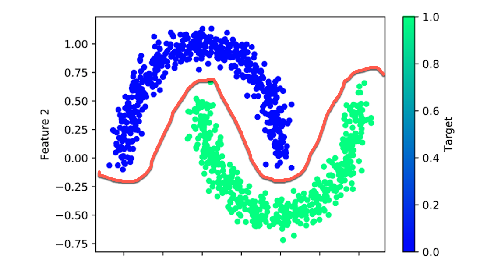

* Inform the students that in these cases, we must create a neural network model capable of identifying complex nonlinear relationships.

* Answer any questions before proceeding to the next activity.

</details>

<details>
  <summary><strong>📣 2.2 Instructor Do: Getting Deep with Deep Learning Models (0:10)</strong></summary>

* You can use slides 18 - 38 to assist you with this activity.

* Point out to the students that when it comes to basic neural network models, they are designed so that input values are evaluated *only once* before they are used in an output classification or regression equation.

  * Therefore, basic neural networks are limited to interpreting simple linear relationships and data with few **confounding factors**, or factors that have hidden effects on more than one variable.

* Explain that in order to address and overcome the limitations of the basic neural network, we can implement a more robust neural network model by adding additional hidden layers.

* Let the students know that a neural network model with more than one hidden layer is known as a **deep neural network**, or **deep learning model**.

* You can use **slides 22 - 29** to assist you with the following section. 

* Show the students the following image:

  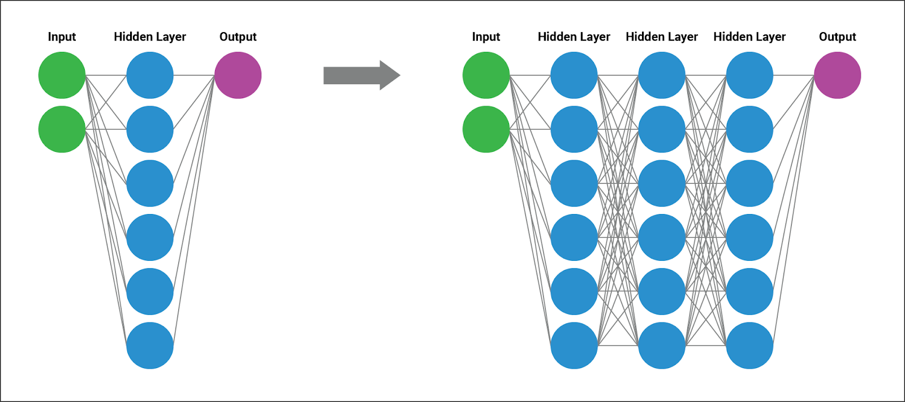

* Emphasize that deep learning models function similarly to the basic neural network with one major exception. The outputs of one hidden layer become the inputs to additional hidden layers of neurons.

* Point out that as a result, the next layer of neurons can evaluate higher-order interactions between weighted variables and identify complex, nonlinear relationships.

* Next, go over the following features of deep learning models:

  * A deep learning model can identify and account for more information than any number of neurons in any single hidden layer.

  * Deep learning models got their name from their ability to learn from example data, regardless of the complexity or type of data.

  * Just like humans, deep learning models can identify patterns, determine severity, and adapt to changing input data from a wide variety of sources.

  * Although the numbers are constantly debated, many data scientists believe that even the most complex interactions can be characterized by as few as three hidden layers.

  * Deep learning models can train on images, natural language data, soundwaves, and even traditional tabular data, all with minimal preprocessing and direction. 

* Inform the students that just like basic neural network models, deep learning models are not a new concept. However, because deep learning models are computationally intensive, they were not feasible for data science until implementation became easier with libraries like TensorFlow, and even then until computing power became more affordable.

* Point out that deep learning models typically require longer training iterations and more memory resources than their basic neural network counterparts in order to achieve higher degrees of accuracy and precision.

  * In other words, deep learning models may have more upfront costs, but they also have higher performance potential.

* Explain that the easiest way to conceptualize the performance differences between basic neural networks and deep learning models is to return to the TensorFlow Playground.

* Slack out the link to the [TensorFlow Playground](https://playground.tensorflow.org/#activation=tanh&batchSize=10&dataset=spiral&regDataset=reg-plane&learningRate=0.03&regularizationRate=0&noise=0&networkShape=6&seed=0.14370&showTestData=false&discretize=false&percTrainData=50&x=true&y=true&xTimesY=false&xSquared=false&ySquared=false&cosX=false&sinX=false&cosY=false&sinY=false&collectStats=false&problem=classification&initZero=false&hideText=false) to the students. Note that this link will pre-populate the simulation with:

* Select the spiral dataset and one layer with 6 neurons:

  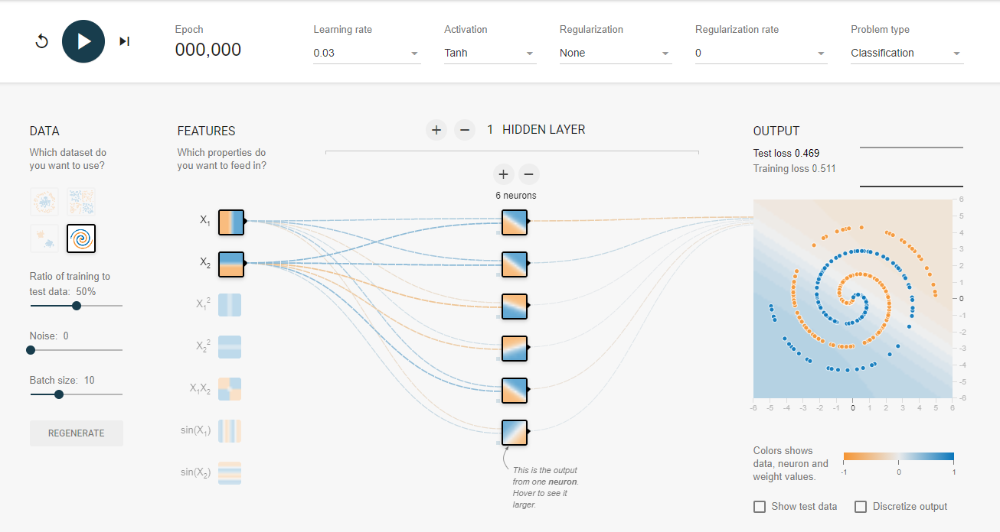

  * Point out that in this TensorFlow Playground simulation, we will use the spiral dataset, which is not linearly separable.

* Let the students know that we will start by training our basic single-layer, six-neuron basic neural network over 1,000 epochs. Run the model through approximately 1,000 epochs in your web browser.

  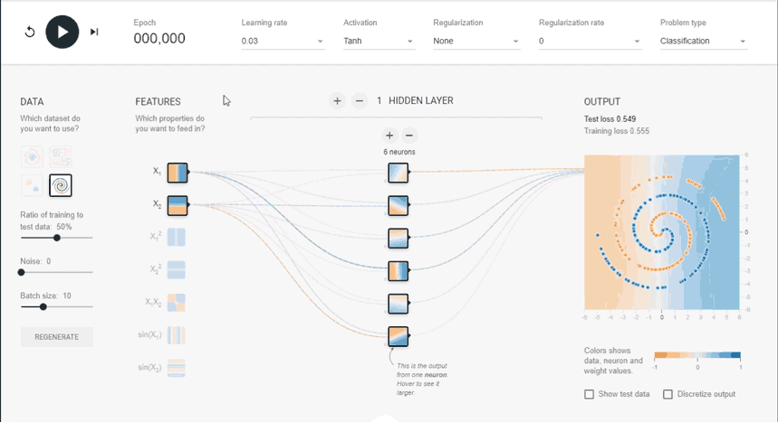

* Emphasize that with only 6 neurons, the neural network model struggles to correctly predict the test data points.

* Next, we will add an additional hidden layer with six neurons by pressing the plus (+) button next to "Hidden Layer," then pressing the plus button to add neurons to the second hidden layer.

  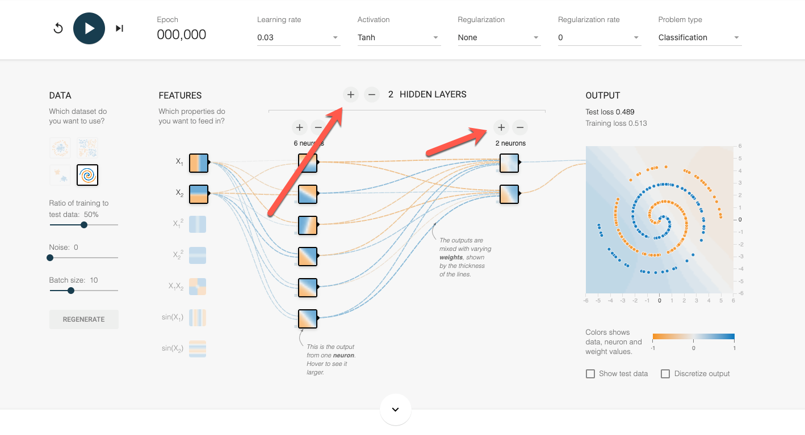

* Run the new deep learning model through 1,000 epochs. Point out to the students that the deep learning model is able to reduce the test loss at a much faster rate than the basic neural network model.

  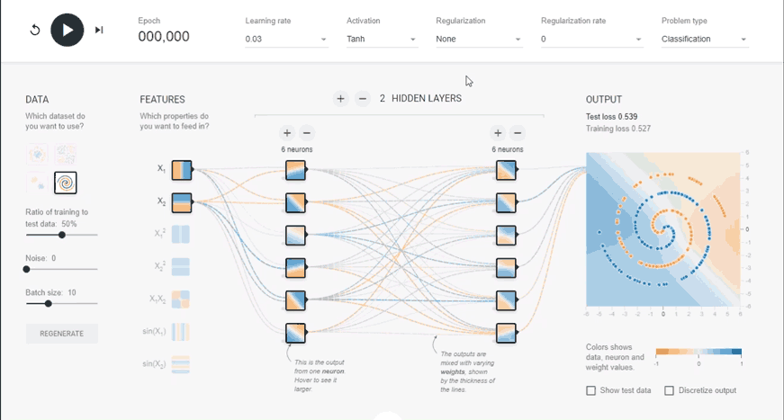

* Explain that TensorFlow Playground shows us that the output of each neuron in the first layer is an input to each neuron in the second layer. As a result, the model is able to identify interactions between different features in more complex dimensions.

* Mention that the model is able to achieve better performance with the same input data in fewer epochs because the model has more opportunities to identify features and interactions of interest within each epoch.

* You can use **slides 30 - 32** to assist you with the following section. 

* Let the students know that although it may be tempting to add more and more layers to boost a deep learning model’s performance, there are diminishing returns. Point out the following drawbacks to building a deep learning model with too many layers:

  * Deep learning models require more and more computational resources&mdash;such as memory and CPU power&mdash;for each layer. If we have limited resources, like time, a larger deep learning model may be infeasible.

  * A deep learning model takes considerably more time to train than a basic neural network. Each hidden layer increases the computations by another order of magnitude.

  * The more hidden layers a model has, the more dimensions the model will consider. Therefore, a model with multiple hidden layers will require more training data to produce an adequate model.

* Ask the class the following questions and call on students for the answers:

    * **Q:** Where have we used this before?

    * **A:** An overview of deep learning and conceptualizing a deep learning model with the TensorFlow Playground were both covered in Lesson 19.4.1.

    * **Q:** How does this activity equip us for the Challenge?

    * **A:** We will need to understand a deep learning model that increases classification accuracy to complete the Challenge.

    * **Q:** What can we do if we don't completely understand this?

    * **A:** We can refer to the lesson plan and reach out to the instructional team for help.

* Be sure to answer any student questions before moving on to the next student activity.

</details>

<details>
  <summary><strong>✏️ 2.3 Students Do: Back to the Moon (0:15)</strong></summary>

* You can use slides 33 and 34 to introduce this activity.

* In this activity, students will try to build a deep learning classification model that can adequately predict the class from our moons dummy dataset.

* Make sure the students can download and open the [instructions](Activities/02-Stu_BackToTheMoon/README.md) and the [Back_To_The_Moon_starter.ipynb](Activities/02-Stu_BackToTheMoon/Unsolved/Back_To_The_Moon_starter.ipynb) file from the AWS link.

* Go over the instructions with the students and answer any questions before breaking the students out in groups. 

* Divide students into groups of 3-5. They should work on the solution by themselves, but they can talk to others in their group to get tips.

* Let students know that they may be asked to share and walk through their work at the end of the activity.

</details>

<details>
  <summary><strong>⭐ 2.4 Review: Picking our Brains on Neural Networks (0:05)</strong></summary>

* Once time is up, ask for volunteers to walk through their solution. Remind them that it is perfectly alright if they didn't finish the activity. 

* To encourage participation, you can open the [Back_To_The_Moon_starter.ipynb](Activities/02-Stu_BackToTheMoon/Unsolved/Back_To_The_Moon_starter.ipynb) file in Jupyter Notebook or Google Colab and ask the students to help you complete each part.

* If there are no volunteers, open up the solved [02-Stu_BackToTheMoon/Solved/Back_To_The_Moon.ipynb](Activities/02-Stu_BackToTheMoon/Solved/Back_To_The_Moon.ipynb) within Jupyter Notebook or Google Colab and go through the code line by line with the class, answering whatever questions they may have. Be sure to point out the following:

  * To convert our basic neural network model to a deep learning model in Keras, we add dense layers.

  * The layers in a deep learning model do not need a large number of neurons. In this case, we only used 6 neurons in both hidden layers.

  * Because of the number of computations and dimensionality, deep learning models tend to require more training iterations/epochs to achieve desired performance than basic neural networks. In this example, our model achieved 100% predictive accuracy after roughly 150 epochs.
  
    * **NOTE:** Your results may vary.

* Be sure to answer any students' questions before moving on.


</details>


- - -

### 3. Getting the Most Out of a Neural Network Model

| Activity Time:       0:45 |  Elapsed Time:      1:30  |
|---------------------------|---------------------------|

<details>
  <summary><strong>📣 3.1 Instructor Do: Getting Hands-on with Model Optimization (0:10)</strong></summary>

* You can use slides 36 - 60 to assist you for this activity.

* Remind the students that as with any machine learning model, neural networks and deep learning models are not perfect.

* Inform the students that when it comes to model performance, there are two major pain points that we will commonly encounter:

  * A model has **high variance**, or the model adjusts too much to fit the training data and will not generalize well. As a reminder, this is known as **overfitting** the model.

  * A model can have **high bias**, or the input data is very noisy and the model is **underfitting** the data. In other words, our model struggles to classify or predict our training dataset.

* You can use **slides 38 - 47** to assist you with the following section. 

#### Overfitting

* Emphasize that when a model is overfitting and does not meet performance expectations, it is usually due to one of two causes:

  * Training and test data are unbalanced, and the training data is not representative of the test data.

  * There is not enough complexity in the training data, and the model converges too quickly (we will discuss **convergence** in detail later in the lesson).

* Point out that to fix a model that has high variance and is overfitting, the most straightforward solution is to add more training data.

* Go over the two ways to increase our training data and discuss the pros and cons of each.

  1. The first way to increase the training data is to collect more data for your input dataset.

      * This is the safest means of increasing training data if collected properly, using the same protocol as the initial data collection.

      * The problem with collecting more input data is that it may be logistically or financially impossible.

  2. The second means of increasing the training data is to change the split ratio of the training and testing data split of the original input data.

     * The benefit to this method is that no new data collection is necessary; therefore, there is no additional financial or logistical cost.

      * The downside to this method is that there will be less data to use to test and validate the model. This means there is a higher risk that we might erroneously consider an underperforming model as adequate.


* Point out that alternatively, we can keep our training data the same and retrain the model using less epochs.

  * This can be a safer alternative with smaller, simpler datasets, but it may be ineffective for larger datasets with many features.

#### Underfitting

* Next, mention that when a neural network model is underfitting and does not meet performance expectations, it is usually because of one of two causes:

  * Training data that contains too many outliers or confusing variables

  * There are inadequate or inappropriate model design parameters, often referred to as **hyperparameters**.

* To determine if the model is underfitting, it is a best practice to check for outliers in the training data since the process is fast and straightforward. 

* Open and execute [03-Ins_SynapticBoost/Solved/SynapticBoost.ipynb](Activities/03-Ins_SynapticBoost/Solved/SynapticBoost.ipynb) in Jupyter Notebook or Google Colab. 

* Remind students how to check for outliers by running the following block of code:

  ```python
  # Dependencies
  import numpy as np
  import matplotlib.pyplot as plt

  # Example outlier plot of reaction times
  times = [96,98,100,105,85,88,95,100,101,102,97,98,75]
  fig1, ax1 = plt.subplots()
  ax1.set_title('Reaction Times at Baseball Batting Cage')
  ax1.set_ylabel('Reaction Time (ms)')
  ax1.boxplot(times)
  plt.show()
  ```

  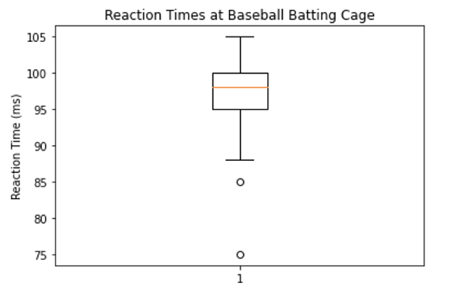

* Mention to students that this data represents a sample collected from a larger dataset of MLB player statistics.

* Remind students that the easiest way to check for outliers qualitatively is to use a boxplot, and the easiest way to check quantitatively is to apply the **1.5*IQR** rule with the following code:

  ```python
    # Determine which data points are outside of the 1.5*IQR range
    quartiles = np.quantile(times,[.25,.75])
    iqr = quartiles[1]-quartiles[0]
    lower_bound = quartiles[0]-(1.5*iqr)
    upper_bound = quartiles[1]+(1.5*iqr)

    # Print the potential outliers
    potential_outliers = [print(time) if time < lower_bound or time > upper_bound else next for time in times]
  ```

* You can use **slides 48 - 50** to assist you with the following section.

* Caution students that while neural networks are tolerant of noisy characteristics in a dataset, neural networks can learn bad habits&mdash;just like our brains.

  * It is important to identify variables that contain a number of potential outliers because they can affect our data preprocessing, causing more important variables and features to disappear.

* Let the students know that later in this class, we will learn how to handle different types of input data and how to use preprocessing tools to maximize the effectiveness of noisy data.

*  Mention that when it comes to tweaking our underfitting neural network model, figuring out which hyperparameters to tweak can become overwhelming. For the purposes of this course, we will focus on higher level hyperparameters that can be altered to achieve desired performance, such as:
    * The number of neurons in a hidden layer.
    * The number of hidden layers in a deep learning model.
    * The activation function for each hidden layer.
    * The number of epochs in the training regimen.

* Point out that we have already been tweaking and testing different hyperparameters in our neural network and deep learning models without realizing it! However, there are general rules we can apply to our hyperparameter tuning to make our models more effective.

* You can use **slides 51 - 60** to assist you for the following section. 

* Indicate to the students that there is a tradeoff between computational resources and model strength when adding additional neurons. Therefore, a good rule of thumb when building the initial model is to **use two to three times as many neurons as there are input features (values)**.  

  * If this does not achieve desired performance, we can always add more neurons as long as we have the computational resources.

* Similarly, we can try to boost the performance of a deep learning model by creating additional hidden layers.

* Point out that deep learning models require substantially more training iterations and memory resources with each additional hidden layer.

* Inform the students that although the numbers are constantly debated, many data scientists and engineers believe that even the most complex interaction can be characterized by as few as three hidden layers. Therefore, a good starting point for deep learning model optimization is to try to limit the number of hidden layers to between two and four.

  * Depending on the size and complexity of the input data, we may need to exceed the recommended number of hidden layers.

* Mention that one of the most effective means of optimizing our neural network and deep learning models is to alter the activation functions for each hidden layer.

  * Depending on the shape and dimensionality of the input data, one activation function may focus on specific characteristics of the input values, while another activation function may focus on others.

* Express that it is important to use an activation function that matches the complexity of the input data. Each of the most popular activation functions has ideal use cases and datasets:

  * The **sigmoid function** values are normalized to a probability between 0 and 1, which is ideal for a binary classification dataset.

  * The **tanh function** can be used for classification or regression, as the normalized values range between -1 and 1.

  * The **ReLU function** is ideal for modeling positive, nonlinear input data for classification or regression. The **ReLU function** is always a good starting point, but not all data is positive, especially when normalized.

  * The **leaky ReLU function** is a good alternative to the ReLU function because of its ability to characterize negative input values.

* Mention that a good rule of thumb is to try selecting slightly more complex activation functions for your hidden layers than your output layer. Using a higher complexity activation function will assess the input data differently without any risk of censoring or ignoring lower complexity features.

* Explain that if the model does not meet performance expectations after changing activation functions for each hidden layer, then we can increase the number of training epochs.

  * Point out that as the number of epochs increases, so does the amount of information provided to each neuron.

  * Each training iteration tweaks the neuron's weight coefficients; therefore, each epoch increases the likelihood that the model is utilizing effective weight coefficients.

* Caution students that adding more epochs to the training parameters is not a perfect solution. 

  * If the model produces weight coefficients that are too effective at analyzing the training data&mdash;the model is tailored to meet the demands of the current data&mdash;then it may not generalize well.

  * Also, point out that if a model only performs well on the training dataset, the model is **overfitted**.

* Emphasize that models should be tested and evaluated each time the number of epochs is increased; this will reduce the risk of overfitting.

* Point out that a good rule of thumb is to start with a smaller number of epochs, such as 100, and add more training epochs until training loss starts to decrease at a slower rate.

  * This threshold for the number of epochs can vary substantially between datasets. For example, large datasets with hundreds of thousands of input values can start at 1,000 epochs (or even more!) without the risk of overfitting.

* Finally, show the students the following table:

  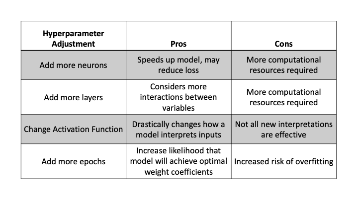

  * Alternatively, you can send the students the PDF version of the [optimization table](Activities/03-Ins_SynapticBoost/Resources/Optimization_Table.pdf). 

* Mention that this list of model-optimization techniques is not exhaustive: there are many more nuanced and specific optimization tweaks we can perform on TensorFlow neural network models.

* Slack out links to model optimization resources that students may find useful, such as [this article, which lays out 20 different techniques to optimize deep learning models](https://machinelearningmastery.com/improve-deep-learning-performance/).

* Ask the class the following questions and call on students for the answers:

    * **Q:** Where have we used this before?

    * **A:** Model optimization&mdash;adding more hidden layers and using different activation functions&mdash;was covered in Lessons 19.2.5 and 19.2.6.

    * **Q:** How does this activity equip us for the Challenge?

    * **A:** We will need to know how to optimize our neural network model to complete the Challenge.

    * **Q:** What can we do if we don't completely understand this?

    * **A:** We can refer to the lesson plan and reach out to the instructional team for help.

* Be sure to answer any student questions before moving on to the next activity.

</details>

<details>
  <summary><strong>📣 3.2 Instructor Do: Take the Guesswork out of Model Optimization (0:15)</strong></summary>

* You can use slides 61 - 64 to assist you for this activity.

* Point out that model optimization is often the most tedious and critical step in designing an effective machine learning model. When it comes to neural network models, even small changes to model hyperparameters can cause large changes to overall model performance.

* Mention that when TensorFlow 2.0 was released, they also released libraries and tools that can automate neural network model optimization. These tools remove a lot of the guesswork about where to start with a nominal neural network and deep learning model.

* Make sure the students can download and open the [Automated_NN_Optimizer.ipynb](Activities/04-Ins_AutoOptimization/Unsolved/Automated_NN_Optimizer.ipynb) file from the AWS link.

* Upload the [04-Ins_AutoOptimization\Solved\Automated_NN_Optimizer.ipynb](Activities/04-Ins_AutoOptimization/Solved/Automated_NN_Optimizer.ipynb) file to Google Colab.

* Run the following cell in Google Colab and inform the students that this command will install the `keras-tuner` package:

  ```
  !pip install keras-tuner

  ```

  * **Note:** If the students want to run the code in Jupyter Notebook, make sure they have upgraded to at least TensorFlow 2.1.0 in their conda environment, using `pip install --upgrade tensorflow==2.1.0` or `pip install --upgrade tensorflow`.

* Point out that the `keras-tuner` package allows us to build a testing environment that evaluates a number of model configurations and returns the best-performing model design and hyperparameters.

  * **Note:** This testing framework is not comprehensive, and further tweaking may be required to achieve the desired results. However, the `keras-tuner` will most likely provide a "good enough" model.

* Run the first cell of code to import our dependencies and recreate our previous moon training and testing datasets:

  ```python
  # Import our dependencies
  import pandas as pd
  import matplotlib as plt
  import sklearn as skl
  import tensorflow as tf
  from sklearn.datasets import make_moons

  # Creating dummy nonlinear data
  X_moons, y_moons = make_moons(n_samples=1000, noise=0.08, random_state=78)

  # Transforming y_moons to a vertical vector
  y_moons = y_moons.reshape(-1, 1)

  # Creating a DataFrame to plot the nonlinear dummy data
  df_moons = pd.DataFrame(X_moons, columns=["Feature 1", "Feature 2"])
  df_moons["Target"] = y_moons

  # Use sklearn to split dataset
  from sklearn.model_selection import train_test_split
  X_train, X_test, y_train, y_test = train_test_split(X_moons, y_moons, random_state=78)

  # Create scaler instance
  X_scaler = skl.preprocessing.StandardScaler()

  # Fit the scaler
  X_scaler.fit(X_train)

  # Scale the data
  X_train_scaled = X_scaler.transform(X_train)
  X_test_scaled = X_scaler.transform(X_test)
  ```

* Let the students know that we will once again use the moons dataset to try and build a deep learning model that can accurately predict the classes within the test dataset. However, this time, we will allow `keras-tuner` to decide the hyperparameters of our model.

* Mention that unlike our previous workflow&mdash;where we designed, compiled, and trained our neural network model in separate steps&mdash;a hyperparameter-tuning workflow requires us to build a testing framework and let `keras-tuner` design, compile, and train for us.

* Point out that there are benefits and costs to using a hyperparameter tuner:

  * Once the testing framework is designed, a hyperparameter tuner will exhaustively test all possible configurations of the model hyperparameters to determine which configuration performs best. This reduces the risk of selecting inadequate hyperparameters that can severely limit the capabilities of your model.

  * Because of the exhaustive nature of hyperparameter tuners, these tools take a long time to complete. You can reduce the runtime of a tuner by reducing the possible testing options, but this will limit the overall effectiveness of the tuner.

  * If time and computing resources are not limited, you can provide the tool with a large number of hyperparameter options and training epochs to create extremely effective neural networks and deep learning models.

* Reassure students that building the testing framework is very similar to building a neural network or deep learning model, with two exceptions:

  * Our model design will need to be wrapped in a custom method.

  * Any hyperparameters we want to evaluate will use a special syntax.

* Run the next code block:

  ```python
  # Create a method that creates a new Sequential model with hyperparameter options
  def create_model(hp):
      nn_model = tf.keras.models.Sequential()

      # Allow kerastuner to decide which activation function to use in hidden layers
      activation = hp.Choice('activation',['relu','tanh','sigmoid'])

      # Allow kerastuner to decide number of neurons in first layer
      nn_model.add(tf.keras.layers.Dense(units=hp.Int('first_units',
          min_value=1,
          max_value=10,
          step=2), activation=activation, input_dim=2))

      # Allow kerastuner to decide number of hidden layers and neurons in hidden layers
      for i in range(hp.Int('num_layers', 1, 6)):
          nn_model.add(tf.keras.layers.Dense(units=hp.Int('units_' + str(i),
              min_value=1,
              max_value=10,
              step=2),
              activation=activation))

      nn_model.add(tf.keras.layers.Dense(units=1, activation="sigmoid"))

      # Compile the model
      nn_model.compile(loss="binary_crossentropy", optimizer='adam', metrics=["accuracy"])

      return nn_model
  ```

* Remind the students that the first step when building the tuner framework is to instantiate the Keras Sequential model. Each time our *create_model* method is called by the tuner, it will create a new model.

* Mention that the next step in our framework is to allow *keras_tuner* to select the activation function to use within the hidden layers. To create a list of hyperparameters to choose from, we will use the [`Choice()` method](https://keras-team.github.io/keras-tuner/documentation/hyperparameters/#choice-method).

  * The **`Choice()` method** requires two arguments: a reader-friendly name for the hyperparameter being tested and a list of hyperparameter options.

*After we finish setting up the activation function test case, we need to set up our first layer. Remind the students that our first Dense layer contains the input layer and first hidden layer.

* Also remind the students that our first Dense layer will have two hyperparameters to test:

   * The activation function, which will use the activation variable.

   * The number of neurons in the first hidden layer, which will use the [Int method](https://keras-team.github.io/keras-tuner/documentation/hyperparameters/#int-method) to test a range of values.

* Point out that the **`Int()` method** will test a range of possible values starting from the *min_value* to *max_value*, separated by the *steps*.

  * Depending on how large of a range and how wide the steps are, the **`Int()` method** can create a large number of test cases for the tuner.

  * To minimize our search space and the runtime of our tuner, we will limit the maximum number of neurons to 10 and steps to 2.

* The next step in our framework is to allow `keras-tuner` to determine how many dense layers our data requires and how many neurons will be in each layer. Both of these hyperparameters will use the `Int()` method.

  * Mention that this step is very resource intensive because it contains nested test cases. Therefore, we will limit both `Int()` methods for the sake of runtime.

  * In an ideal case, you would allow the tuner to test a large combination of layer and neuron sizes. Oftentimes, people will allow hyperparameter tuners to test a dozen or more layers and up to 100 neurons per layer.

* Point out that our final step of the framework in the code block above is to add our output layer, compile the neural network model, and return the model at the end of the method.

* Now that the framework is ready, the next step is to import the `keras-tuner` library and create our tuner class.

* Run the next line of code to create our tuner instance:

  ```python
  # Import the kerastuner library
  import kerastuner as kt

  tuner = kt.Hyperband(
      create_model,
      objective="val_accuracy",
      max_epochs=20,
      hyperband_iterations=2,
      overwrite=True,
      project_name="NN_Optimization_checkpoints")
  ```

* Point out the following features of our tuner instance:

  * The **Hyperband** tuner is currently the most popular tuning algorithm in `keras-tuner` because of its semi-intelligent search function and early stopping capabilities. There are other other tuning algorithms we can use, but they run longer with no substantial benefits.

  * The *objective* argument of the Hyperband tuner tells the `keras-tuner` what metric the model should try to minimize or maximize. In most cases, we want our model to maximize the analytical accuracy against the validation/testing dataset.

  * The *max_epochs* argument tells the tuner how many epochs to train the model before moving on. To maximize the (resource) cost-benefit ratio, we want to set our *max_epochs* to when our model **converges** to, or approaches, its minimum training loss. When it comes to our moons dataset, convergence will typically occur within 10 to 30 epochs, but convergence can happen much later in more complex datasets.

    * Generally speaking, a model is considered to be converging when the model loss metric stops decreasing between epochs or does not meet a cutoff rate.

    * Feel free to show the students the following image that illustrates model convergence. We typically refer to convergence in terms of model loss rather than model accuracy.

      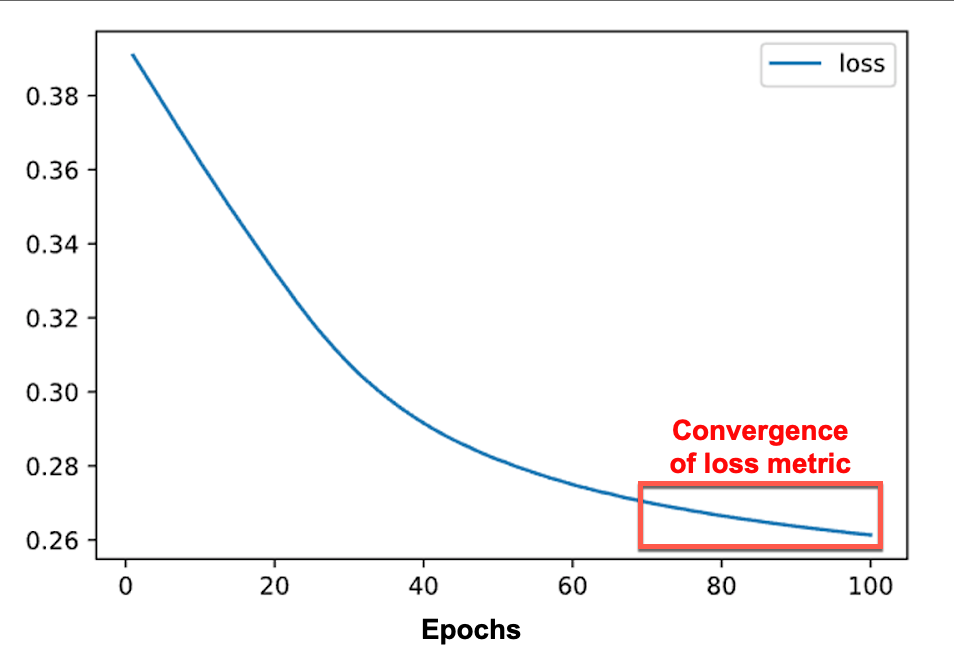

  * The *hyperband_iterations* argument tells `keras-tuner` how many times to run the testing framework. Since each iteration uses different starting points for each model, more iterations mean more chances for the tuner to identify the best-performing hyperparameters.

  * The *overwrite* argument allows us to rerun the cell or file and write over the saved checkpoints that are in the "NN_TuneUp_checkpoints" folder in your directory. 

  * The *project_name* argument names the folder in your directory. If there is no defined project name, then the default folder name is "untitled_project". 

* Point out to the students that for the sake of class time, we are severely limiting the search space of our hyperparameter tuner. However, if we were to use a tuner on our own models outside of class, it is in our best interest to maximize the search parameters that our time and computing resources will allow in order to increase the chance of finding the best model.

  * The parameters that we can increase to maximize effectiveness should be (in order of priority) *hyperband_iterations*, *max_value* argument for each Int tuner, and the *step* argument for each Int tuner.

* Execute the next block of code, which runs our testing framework to search for the best hyperparameters:

  ```python
  # Run the kerastuner search for best hyperparameters
  tuner.search(X_train_scaled,y_train,epochs=20,validation_data=(X_test_scaled,y_test))
  ```

  * Explain that depending on how many test cases, epochs, and iterations you included in the testing framework, “keras-tuner's” search method can take from minutes to hours to complete. Thankfully, we selected smaller test parameters so our algorithm will only take a few minutes to complete.

    * **Note:** On most computers, this search function should complete within 5 minutes. Use this opportunity to answer any student questions while the search algorithm is working.

  * Once the search is complete, we can look at the best-performing hyperparameters as well as obtain the trained model directly!

  * Run the next block of code, which stores the parameters and evaluates the best-tuned model:

  ```python
  # Get best model hyperparameters
  best_hyper = tuner.get_best_hyperparameters(1)[0]

  # Evaluate best model against full test data
  best_model = tuner.get_best_models(1)[0]
  model_loss, model_accuracy = best_model.evaluate(X_test_scaled,y_test,verbose=2)
  print(f"Loss: {model_loss}, Accuracy: {model_accuracy}")
  ```

* Mention that from our tuner, we were able to produce a model capable of accurately predicting our testing data without any direct influence.

* Point out that if the tuned model was still underperforming, we could train the model with more epochs to boost performance.

* Finally, let the students know that although hyperparameter tuning is not always ideal, it takes away much of the guesswork needed to build an adequate model from a large or difficult dataset.

* Ask the class the following questions and call on students for the answers:

    * **Q:** Where have we used this before?

    * **A:** Even though we didn't cover model optimization using the `keras-tuner` in this module, model optimization was covered in Lessons 19.2.5 and 19.2.6.

    * **Q:** How does this activity equip us for the Challenge?

    * **A:** We will need to know how to optimize our neural network model to complete the Challenge.

    * **Q:** What can we do if we don't completely understand this?

    * **A:** We can refer to the lesson plan and reach out to the instructional team for help.

* Be sure to answer any student questions before moving on to the student activity.

</details>

<details>
  <summary><strong>✏️ 3.3 Student Do: Giving Your Model Building a Tune-up (0:15)</strong></summary>

* You can use slides 65 and 66 for this activity.

* In this activity, students will use `keras-tuner` to create a model that can adequately predict scikit-learn's *make_circles* dataset.

* Make sure that the students can download and open the [instructions](Activities/05-Stu_TuneUp/README.md) and the [NN_TuneUp_starter.ipynb](Activities/05-Stu_TuneUp/Unsolved/NN_TuneUp_starter.ipynb) file from the AWS link.

* Go over the instructions with the students and answer any questions before breaking the students out in groups. 

* Divide students into groups of 3-5. They should work on the solution by themselves, but they can talk to others in their group to get tips.

* Let students know that they may be asked to share and walk through their work at the end of the activity.

</details>

<details>
  <summary><strong>⭐ 3.4 Review: Giving Your Model Building a Tune-Up (0:05)</strong></summary>

* Once time is up, ask for volunteers to walk through their solution. Remind them that it is perfectly alright if they didn't finish the activity. 

* To encourage participation, you can open the [NN_TuneUp_starter.ipynb](Activities/05-Stu_TuneUp/Unsolved/NN_TuneUp_starter.ipynb) file in Jupyter Notebook or Google Colab and ask the students to help you complete each part. 

  * If the students provide a solution, make sure to point out the highlights below:

* If there are no volunteers, open up the solved [NN_TuneUp.ipynb](Activities/05-Stu_TuneUp/Solved/NN_TuneUp.ipynb) within Jupyter Notebook or Google Colab and go through the code line by line with the class, answering whatever questions they may have. Be sure to point out the following:

  * The circle dataset is another dummy dataset where our two classes are not linearly separable. The circles dataset is known for being a particularly challenging classification problem when using only the _x_-axis and _y_-axis as our input data.

  * The custom method to create a new Sequential model is very similar to what we made during the demonstration. There are only a few exceptions:

    * The hyperparameter tuner only needs to choose between the `relu` and `tanh` activation functions.

    * Because the range of neurons is larger than in our demonstration model, we needed to increase the step argument proportionately. Otherwise, the tuner will test more designs than necessary to find an acceptable model.

  * To obtain more than one set of hyperparameters and models from the tuner search, we will provide a number to the *get_best_hyperparameters* and *get_best_models* methods.

  * Point out that across the top three model hyperparameters, there are differences between the activation function within our hidden layers, the number of hidden layers, and the number of neurons within each layer.

    * Although it is not surprising that the hyperparameters vary between each of the top models, it may be surprising how different the combination of parameters are from one another.

    * Typically, we try to stick with the most complex activation function, the ReLu activation function. But our hyperparameter tuner has demonstrated that sometimes the most complex activation function is not the best.

    * By exhaustively testing all allowable combinations of hyperparameters, the tuner allows us to find combinations of hyperparameters that may not be intuitive but are comparable in performance.

  * Once we have our set of hyperparameters and models, we can print the results using a `for` loop.

* Send out the [05-Stu_TuneUp/Solved/NN_TuneUp.ipynb](Activities/05-Stu_TuneUp/Solved/NN_TuneUp.ipynb) file for students to refer to later.

* Be sure to answer any student's questions before moving on.

</details>


- - -

### 4. Using Real-world Data in Keras Neural Network Models

| Activity Time:       0:25 |  Elapsed Time:      1:55  |
|---------------------------|---------------------------|

<details>
  <summary><strong>📣 4.1 Instructor Do: Getting Real with Neural Network Datasets (0:10)</strong></summary>

* You can use slides 67 - 82 to assist you with this activity.

* Let the students know that for the last lesson of today's class, we will learn how to prepare real-world data for our neural network models.

* Point out that when building machine learning models, most of the design effort is not spent writing code to build the complex model. Rather, most of the effort is preprocessing and cleaning up the input data; neural networks and deep learning models are no exception to this rule.

* In reality, neural network models tend to require the most preprocessing of input data compared to all other statistical and machine learning models.

  * This is because most neural networks are really good at identifying patterns and trends in data; therefore, they are susceptible to getting stuck when looking at abstract or raw data.

* Emphasize that when data has many categorical values or large gaps between numerical values, a neural network might think that these variables are less important (or more important) than they really are.

* Go over the following real-world neural network example with the students:

  * If a bank wanted to build a neural network model to identify if a company was eligible for a loan, it might look at factors such as a company’s net worth.

  * If the bank’s input dataset contained information from large fortune 500 companies, such as Google and Facebook, as well as small mom-and-pop stores, the variability in net worth would be outrageous.

  * Without normalizing the input data, a neural network could look at net worth as being a strong indicator of loan eligibility, and as a result, it could ignore all other factors, such as debt-to-income ratio, credit status, or requested loan amount.

  * Instead, if the net worth was normalized on a factor such as number of employees, the neural network would be more likely to weigh other factors more evenly against net worth.

  * This would result in a neural network model that assesses loan eligibility more fairly, without introducing any additional risk.

* Inform the students that this is an example of **preprocessing the input data**&mdash;we alter the input dataset before any computational model training or evaluation.

* Point out that when it comes to preprocessing data for a neural network, we first need to preprocess the categorical data before we preprocess the numerical data.

* **Q:** Ask the students what we use to preprocess categorical data.

* **A:** We preprocess categorical data using the **one-hot encoding** method from scikit-learn.

  * Remind students that one-hot encoding identifies all unique column values and splits a single categorical column into a series of columns, each containing information about a single unique categorical value.

* Show the students the following table:

  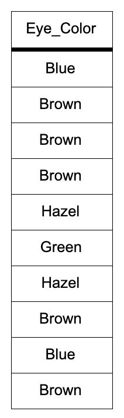

* **Q:** Ask the students to consider the following "eye_color" variable containing a list of eye colors from different people.

* Show the students the next table:

  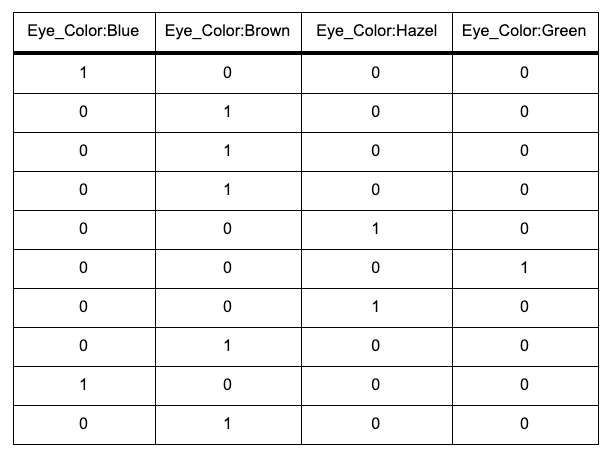

* Point out that this table is the exact same "eye_color" variable encoded using one-hot encoding. Each row has only one column with a value of 1&mdash;the corresponding categorical variable from the original dataset.

* Mention that this binary encoding ensures that each neuron receives the same amount of information from the categorical variable.

* And as a result, the neural network will interpret each value independently and provide each categorical value its own weight in the algorithm.

* Caution students that although one-hot encoding is a very robust solution, it can be memory intensive. Therefore, categorical variables with a large number of unique values, or very large variables with only a few unique values, might become difficult to navigate or filter once encoded.

* Emphasize that to address the issue of memory resourcing, we must reduce the number of unique values in the categorical variables.

* Point out that the process of reducing the number of unique categorical values in a dataset is known as **bucketing** or **binning**.

* Mention that there are two approaches to **bucketing** categorical data:

  * Collapse all of the infrequent and rare categorical values into a single “other” category.

  * Create generalized categorical values and reassign all data points to the new corresponding values.

* Explain that the first bucketing approach takes advantage of the fact that uncommon categories and "edge cases" are rarely statistically significant.

* Emphasize that regression and classification models are unlikely to be able to use rare categorical values to produce robust models. By using the first bucketing method, the algorithm will ignore the rare events altogether and focus on more informative values.

* Next, mention that the second bucketing approach collapses the number of unique categorical values and maintains relative order and magnitude.

* Point out that the second approach is particularly useful when dealing with categorical variables whose distribution of unique values is relatively even.

* Mention that bucketing is less effective when there are only a few unique values. Therefore, a good rule of thumb is to only apply a bucketing strategy when the categorical variables contain 10 or more unique values.

* Once we encode all categorical variables using one-hot encoding, all of our variables in our dataset are now numeric.

* Point out that unlike categorical data, neural network models can interpret and evaluate all forms of numerical data.

* Caution students that even though a neural network model *can* train on raw numerical data, it does not mean that it *should* train on raw data.

* Now, mention the reasons why we should not train a neural network model on raw numerical data:

  * Raw data often has outliers or extreme values that can artificially inflate a variable’s importance.

  * Numerical data can be measured using different units across a dataset—such as time versus temperature or length versus volume.

  * The distribution of a variable can be skewed, leading to misinterpretation of the central tendency.

* Explain that the easiest way to minimize the risks associated with raw numerical data is by standardizing the numerical data prior to training. 

  * **Q:** Ask the student what module we use to standardize the numerical data.
  
  * **A:** We standardize the numerical data using scikit-learn's `StandardScaler()` module.

  * Remind the students that we have already standardized our numerical dummy data using StandardScaler in our previous activities.

* Point out that if we use the `StandardScaler()` module to standardize our numerical variables, we reduce the overall likelihood that outliers, variables of different units, or skewed distributions will have a negative impact on a model’s performance.

* Make sure the students can download and open the [HR-Employee-Attrition.csv](Activities/06-Ins_GettingReal/Resources/HR-Employee-Attrition.csv) and the [06-Ins_GettingReal/Unsolved/GettingReal_Preprocessing_starter.ipynb](Activities/06-Ins_GettingReal/Unsolved/GettingReal_Preprocessing_starter.ipynb) files from the AWS link.

* Explain that our first real-world dataset contains a combination of categorical and numerical data for 1,400 former IBM employees. This dataset was obtained from Kaggle.

* Tell the students that we are trying to build a neural network model that can predict if an employee is at risk of attrition (being fired or quitting) by training on former IBM employee metadata.

* Point out that in order to build a proper neural network model, we must first encode the categorical data and standardize the numerical data.

* Make sure the students import the data and create a DataFrame. Then, send out and run the next block of code:

  ```python
  # Generate our categorical variable lists
  attrition_cat = attrition_df.dtypes[attrition_df.dtypes == "object"].index.tolist()

  # Check the number of unique values in each column
  attrition_df[attrition_cat].nunique()
  ```

* The first step in performing categorical encoding is to get a list of all categorical variables in the dataset.

* Then, once we get our categorical variable list, we must check whether or not we need to perform any binning.

* Explain that the `nunique()` method returns the number of unique elements in the DataFrame, and point out that according to its output here, there are no categorical variables that require binning.

* Next, send out and run the next block of code:

  ```python
  # Create a OneHotEncoder instance
  enc = OneHotEncoder(sparse=False)

  # Fit and transform the OneHotEncoder using the categorical variable list
  encode_df = pd.DataFrame(enc.fit_transform(attrition_df[attrition_cat]))

  # Add the encoded variable names to the DataFrame
  encode_df.columns = enc.get_feature_names(attrition_cat)
  encode_df.head()
  ```

  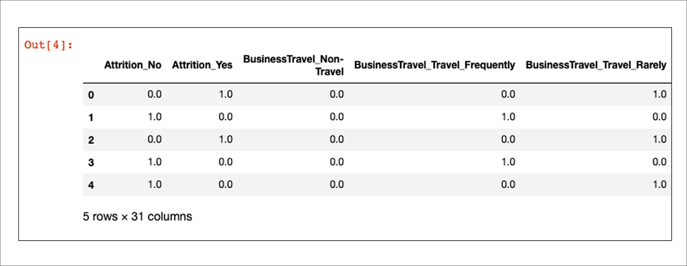

* Explain that scikit-learn's *OneHotEncoder* expects a dataset containing only categorical variables. We can use our categorical variable list to create a subset of our raw DataFrame.

* Point out that scikit-learn's *OneHotEncoder* produces an array of encoded values. In order to make our encoded data more readable, we transform the data back to a Pandas DataFrame.

* Send out and run the next block of code:

  ```python
  # Merge one-hot encoded features and drop the originals
  attrition_df = attrition_df.merge(encode_df,left_index=True, right_index=True)
  attrition_df = attrition_df.drop(attrition_cat,1)
  attrition_df.head()
  ```

* Our next step is to merge our encoded variables with our original numerical variables.

* Send out and run the next block of code:

  ```python
  # Split our preprocessed data into our features and target arrays
  y = attrition_df["Attrition_Yes"].values
  X = attrition_df.drop(["Attrition_Yes","Attrition_No"],1).values

  # Split the preprocessed data into a training and testing dataset
  X_train, X_test, y_train, y_test = train_test_split(X, y, random_state=78)
  ```

* Now that we have our numerical data, we need to split our input data into our model features (labelled **X**) versus our target data (**y**). In addition, we need to split our training and test data.

* Send out and run the next block of code:

  ```python
  # Create a StandardScaler instance
  scaler = StandardScaler()

  # Fit the StandardScaler
  X_scaler = scaler.fit(X_train)

  # Scale the data
  X_train_scaled = X_scaler.transform(X_train)
  X_test_scaled = X_scaler.transform(X_test)
  ```

* Explain that the next step is to standardize all of the input data using scikitlearn's `StandardScaler()` module.

* Emphasize that we fit the `StandardScaler()` to only the training features. This is because we do not want our test dataset used for anything except evaluating the performance of our model. However, we still need to standardize our test data so the trained model does not get confused.

* After we scale the data, it is ready for our neural network model.

* Send out and run the last block of code:

  ```python
  # Define the model - deep neural net
  number_input_features = len(X_train[0])
  hidden_nodes_layer1 =  8
  hidden_nodes_layer2 = 5

  nn = tf.keras.models.Sequential()

  # First hidden layer
  nn.add(
      tf.keras.layers.Dense(units=hidden_nodes_layer1, input_dim=number_input_features, activation="relu")
  )

  # Second hidden layer
  nn.add(tf.keras.layers.Dense(units=hidden_nodes_layer2, activation="relu"))

  # Output layer
  nn.add(tf.keras.layers.Dense(units=1, activation="sigmoid"))

  # Check the structure of the model
  nn.summary()
  ```

* Point out that the code will build a two-layer deep learning model with our HR dataset.

* For the final steps, we need to compile, train, and evaluate our deep learning model on the HR dataset.

* Send out and run the final block of code:

  ```python
  # Compile the model
  nn.compile(loss="binary_crossentropy", optimizer="adam", metrics=["accuracy"])

  # Train the model
  fit_model = nn.fit(X_train,y_train,epochs=100)

  # Evaluate the model using the test data
  model_loss, model_accuracy = nn.evaluate(X_test,y_test,verbose=2)
  print(f"Loss: {model_loss}, Accuracy: {model_accuracy}")
  ```

  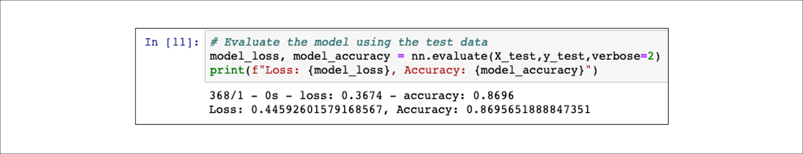

* Send out the [neural network preprocessing logic flowchart](Images/NN_Preprocess_Flowchart.pdf) and show the students the image of the flowchart:

  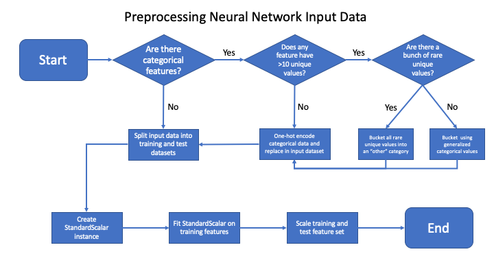

* Explain that we can rely on this logic workflow to help us remember what steps are needed to preprocess any real-world dataset to use in our basic and deep learning neural networks.

* Send out the [06-Ins_GettingReal/Solved/GettingReal_Preprocessing.ipynb](Activities/06-Ins_GettingReal/Solved/GettingReal_Preprocessing.ipynb) file for students to refer to later.

* Be sure to answer any student's questions before moving on to the student activity.

</details>

<details>
  <summary><strong>🎉 4.2 Everyone Do: Detecting Diabetes through Deep Learning (0:15)</strong></summary>

* You can use slides 83 and 84 to assist you in this activity.

* In this activity, students will preprocess a medical dataset and create a deep learning model capable of predicting whether a patient will be diagnosed with diabetes.

* Make sure the students can download and open the [instructions](Activities/07-Stu_DetectingDiabetes/README.md), the [diabetes.csv](Activities/07-Stu_DetectingDiabetes/Resources/diabetes.csv), and the [DetectingDiabetes_starter.ipynb](Activities/07-Stu_DetectingDiabetes/Unsolved/DetectingDiabetes_starter.ipynb) file from the AWS link. 

* Have the students upload [DetectingDiabetes_starter.ipynb](Activities/07-Stu_DetectingDiabetes/Unsolved/DetectingDiabetes_starter.ipynb) into Google Colab and create a DataFrame of the diabetes dataset. 

  * Let the students know that if the AWS link to the dataset in Google Colab is not working, they can run the `DetectingDiabetes_starter.ipynb` file in Jupyter Notebook and use the `diabetes.csv` file that is provided.

* Since you walked the students through the process of creating a deep learning model on a real dataset in the previous activity, ask for volunteers to help you add the code for each cell. 

* If there are no volunteers or students need more guidance, open up the [DetectingDiabetes_starter.ipynb](Activities/07-Stu_DetectingDiabetes/Unsolved/DetectingDiabetes_starter.ipynb) file in Google Colab and either hard code or copy the necessary code from [07-Stu_DetectingDiabetes/DetectingDiabetes.ipynb](Activities/07-Stu_DetectingDiabetes/Solved/DetectingDiabetes.ipynb), pointing out the following:

  * First, we remove the diabetes outcome target from the features, and then we split the data.

    ```python
    # Remove diabetes outcome target from features data
    y = diabetes_df.Outcome.values
    X = diabetes_df.drop(columns="Outcome").values

    # Split training/test datasets
    X_train, X_test, y_train, y_test = train_test_split(X, y, random_state=42, stratify=y)
    ```

  * **Q:** Ask the student what the next step is in the workflow. 
  
  * **A:** Since there is only numerical data, all we need to do is preprocess the numerical data using the `StandardScaler()` module with the following code block:

    ```python
    # Preprocess numerical data for neural network

    # Create a StandardScaler instances
    scaler = StandardScaler()

    # Fit the StandardScaler
    X_scaler = scaler.fit(X_train)

    # Scale the data
    X_train_scaled = X_scaler.transform(X_train)
    X_test_scaled = X_scaler.transform(X_test)
    ```

  * Our diabetes dataset contains eight features across hundreds of data points (>700); therefore, this data is more complex than any dataset we have worked with so far.

  * For this model, we will try a two-layer deep learning model and train the model on 50 epochs. 

    * The first hidden layer contains 16 nodes and uses the `relu` activation function and eight input variables, `input_dim=8`. 

    * The second hidden layer contains 16 nodes and uses the `relu` activation function. 

    * The output layer contains 1 node and uses the `sigmoid` activation function. 

  * After we evaluate the model, we can see that due to the complexity of the dataset, a two-layer deep learning model is not going to be able to produce an adequately predictive model. 

* **Q:** Ask the students what they can do to increase the performance of the deep learning model against the diabetes dataset. Point out the following possibilities:

  * **A1:** We can add more neurons and hidden layers manually and evaluate the performance of each model change.

  * **A2:** Alternatively, we can use the `keras-tuner` package to search for an adequate deep learning model across multiple layers, neurons, and activation functions.

* Send out the [07-Stu_DetectingDiabetes/DetectingDiabetes.ipynb](Activities/07-Stu_DetectingDiabetes/Solved/DetectingDiabetes.ipynb) file for students to refer to later.
* Ask the class the following questions and call on students for the answers:

    * **Q:** Where have we used this before?

    * **A:** 
      * The concepts of one-hot encoding and "bucketing" or "binning" were covered in Lesson 19.3.2.
      * Practicing using one-hot encoding was covered in Lessons 19.3.3 and 19.4.2.
      * Standardizing numerical values using `StandardScaler()` was covered in Lessons 19.3.4, 19.4.2, and 19.4.3.
      * Real design, practice, and evaluation of a deep learning model were covered in Lessons 19.4.4 and 19.4.5. 

    * **Q:** How does this activity equip us for the Challenge?

    * **A:** We will need to know how to optimize our neural network model to complete the Challenge.

    * **Q:** What can we do if we don't completely understand this?

    * **A:** We can refer to the lesson plan and reach out to the instructional team for help.

* Be sure to answer any student questions before ending the class.

</details>


- - -

### 5. Ending Class 

| Activity Time:       0:05 |  Elapsed Time:      2:00  |
|---------------------------|---------------------------|

<details>
  <summary><strong>📣  5.1 Instructor Do: Review </strong></summary>

* Before ending class, review the skills that were covered today and mention where in the module these skills are used: 
  * Model optimization was covered in **Lesson 19.2.5** and **Lesson 19.2.6**.
  * An overview of one-hot encoding and "binning" was provided in **Lesson 19.3.2**.
  * An overview of deep learning and conceptualizing a deep learning model with the TensorFlow Playground was covered in **Lesson 19.4.1**.
  * Using one-hot encoding was covered in **Lesson 19.3.3** and **Lesson 19.4.2**.
  * Standardizing numerical values using `StandardScaler()` was covered in **Lesson 19.3.4**, **Lesson 19.4.2**, and **Lesson 19.4.3**.
  *  Real design, practice, and evaluation of a deep learning model were covered in **Lesson 19.4.4** and **Lesson 19.4.5**.

* Answer any questions the students may have.

</details>


- - - 

© 2021 Trilogy Education Services, LLC, a 2U, Inc. brand.  Confidential and Proprietary.  All Rights Reserved.

