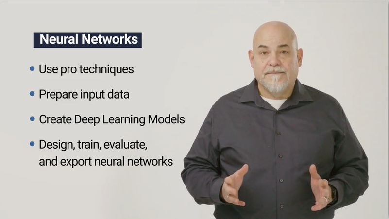
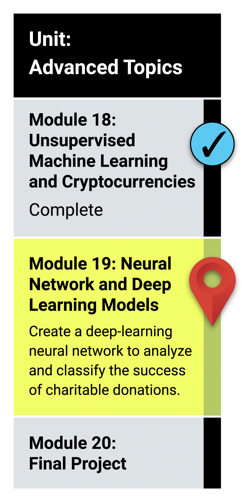

# Module 19: Neural-Networks

## What You Will Learn
By the end of this module, you will be able to:

* Compare the differences between the traditional machine learning classification and regression models and the neural network models.
* Describe the perceptron model and its components.
* Implement neural network models using TensorFlow.
* Explain how different neural network structures change algorithm performance.
* Preprocess and construct datasets for neural network models.
* Compare the differences between neural network models and deep neural networks.
* Implement deep neural network models using TensorFlow.
* Save trained TensorFlow models for later use.
  
## Planning Your Schedule (15 - 20 hours Outside the Virtual Classroom)
Here's a quick look at the lessons and assignments you'll cover in this module. You can use the time estimates to help pace your learning and plan your schedule.

* Introduction to Module 19 (15 minutes)
* Introduction to Neural Networks (30 minutes)
* Build Your First Neural Network (2 hours)
* Prepare Your Neural Network Datasets (2 hours)
* Dig Deeper Into Neural Networks (2 hours)
* Select the Best Model for Your Dataset (2 hours)
* Export and Import Trained Models (1 hour)
* Application (5 hours)

- - -

### Links

[Scikit-learn](https://scikit-learn.org/stable/)

[Tensor Flow](https://www.tensorflow.org/overview/)

[Tensor Flow Playground](https://playground.tensorflow.org/#activation=sigmoid&batchSize=10&dataset=gauss&regDataset=reg-plane&learningRate=0.03&regularizationRate=0&noise=0&networkShape=1&seed=0.10587&showTestData=false&discretize=true&percTrainData=50&x=true&y=true&xTimesY=false&xSquared=false&ySquared=false&cosX=false&sinX=false&cosY=false&sinY=false&collectStats=false&problem=classification&initZero=false&hideText=false&discretize_hide=true&regularization_hide=true&learningRate_hide=true&regularizationRate_hide=true&percTrainData_hide=true&showTestData_hide=true&noise_hide=true&batchSize_hide=true)

[Tensor Flow & Keras](https://www.tensorflow.org/guide/keras/sequential_model)

---

© 2021 Trilogy Education Services, LLC, a 2U, Inc. brand.  Confidential and Proprietary.  All Rights Reserved.
