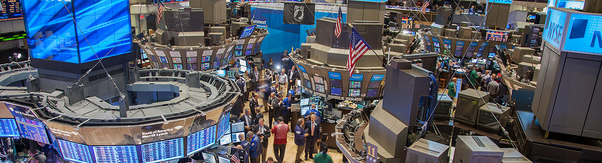
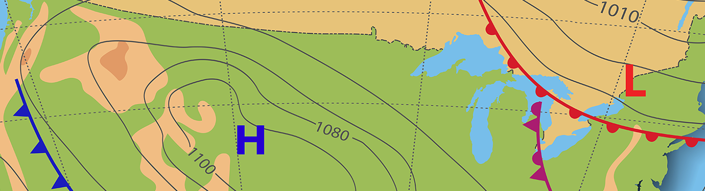
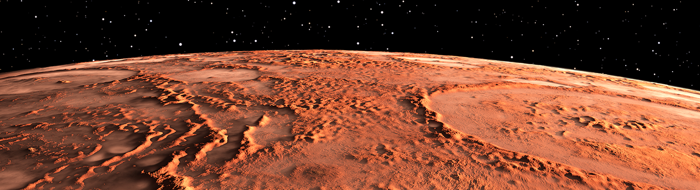

## Purpose: To assist you in your understanding of the assignment topics
The following videos were developed by your instructor to assist in your understanding of the Assignment Topics. If you view a video, I would appreciate some type of feedback to include any corrections, comments, complaints. Your feedback will let me know this type of additional support is appreciated and will encourage me to provide additional assistance on future assignments.
Note: this material is not to be shared. This is bonus support provided by your instructor and not intended for students in other bootcamps.

* Module 2: VBA of Wall Street 
  - Video 1 - Inital Analysis (https://zoom.us/rec/share/LpOqSATLNamBQ4MBCmUWnGcts3lezZClHUIMSZN0GYWBn_CrGJg9Fe8kJylX7pyn.yiIMi4ChwB6s-w57?startTime=1637335741000)
  - Video 2 - Refactoring Analysis (https://zoom.us/rec/share/GCqs10QONVaing6uzSyJ5YXyQEJ8WKVKjlWOqLoRWd_ERW2C2buTeJA8aPwZoPsB.MhSWqG5LCrQrmyK4?startTime=1637415343000)

 

* Module 3: PyPoll with Python (https://zoom.us/rec/play/NgqSdBoLLRs-J-X_bDsJ3z8hp7nnZSRnMHnydAwDfEA26-uBzA4ijxX8Qo0m8-Acoz4QEA7Y7TyV1_Ze.TDxvnbUcra0DXwT3?startTime=1636569115000)

 

* Module 4: PyCitySchools with Pandas (https://zoom.us/rec/play/U2aP18AdenFJUq_SH7vaIiONkNzF0lTX_D1OFcMyKfmuRvNY7nfcmLFFHkuOQzH3l-29p_uJS0EYHLgs.o-WaXmtNrAWRci-r?startTime=1637429499000)

 

* Module 5: PyBer with Matplotlib (https://zoom.us/rec/play/1JkpWoH9UUx9ZHIy1Zczu50pi_jp5xQruDEF-ec88biNvRxzqRPZ7Mn[…]qFve4nrenT.VK05ZxqSYPvBCFCW?autoplay=true&startTime=1637639050000) 
  
 

* Module 6: WeatherPy with Python APIs 
   
   - Deliverable 1 Video: (https://zoom.us/rec/play/r_PyWOVKHFzukmGTbpKRnBPeZtRBJ_F9P6LutdKwQzquPkoJiIZDbRl[…]dk6XhGwvKI.9W-KcjRfn9Epd8hM?autoplay=true&startTime=1638467138000)
   - Deliverable 2 & 3 Video: (https://zoom.us/rec/share/zNhyCkba28cYb5CYaBiykgl_AuxS9kiVvxidMGOvO3rFMykowEyiZTP5fZ_Ch8nU.U7rgI2XUg5ATV3UY?startTime=1638536782000)

 

* Module 7: Employee Database with SQL 
  - Deliverable 1 Video (https://zoom.us/rec/play/eHoX1KlfbjdTfc5-fUYRbU-IlHnBa8UKmgJknRSzTiQnQnv_06FG3Kw[…]ctcF_ICH-j.lHlDTkANOUJ7uu2o?autoplay=true&startTime=1638549459000)
  - Deliverable 2 Video (https://zoom.us/rec/play/zhdEpkHLxhaWb_zXTWgL19CvTylPCBVhdR5FGDnjVkVxpa2BPQjUk1H[…]GQw3lLNp-K.SsEYKaIw0slq1pjz?autoplay=true&startTime=1638556651000)

 

* Module 8: ETL - Extract, Transform, Load (https://zoom.us/rec/play/BmlPsofX-fOZH-vYQzVtt6U3xAH0ndY8Rs3oU-aPc3PwOgYtCCX0QCJ[…]qEYXUAoms1.tHkBrJnUjz1WLJgW?autoplay=true&startTime=1639148157000)
  - Methodology: [ETL Methodology Available in Methodology folder](./Methodology/ETL_Methodology.pptx)

 

* Module 9: Surf's Up with Advanced Data Storage and Retrieval (https://zoom.us/rec/play/96z48qqqLl27IUsq1m11T2oMl7ePUsO1Ul7zP8xEZ1fDgOhvTcomi1D[…]4uA6xun_ot.gLMcTNub2iZd24n2?autoplay=true&startTime=1639919012000)

 

* Module 10: Mission to Mars - Webscraping with HTML/CSS (https://zoom.us/rec/play/uN6hZ-DsNkaXrzeEiGwH1tvqohyebRvmqhCoxO-cu3P6wjR0iHJDld2vGCYauBpTiWg1a_mSNt-wdd2F.RuO31gc5NyGrjQ9W?startTime=1640350234000)

 

* Module 11: UFO Sighting with JavaScript 
  - Video 1: (https://zoom.us/rec/play/ceWfSKPZGAsSTYzrliDBPhYcUnNC-QK1PGztIwsWOcewt85xyJy_8a4[…]7dkHAOBjxv.-qbMN3zNHkmUW4i_?autoplay=true&startTime=1641578899000) 
  - Video 2: (https://zoom.us/rec/play/hswv716-8bVF6QAsFeQxBwi5tejzJzScPbTg_zUuxju0BJ-U2_r4CO9[…]69YwXB3EWU.lCScZeDv1Go7WzgF?autoplay=true&startTime=1641584722000)
  - Methodology: [UFO Methodology Available in Methodology folder](./Methodology/Methodology_UFO_Challenge.pptx)

 

* Module 12: Biodiversity with Plotly 
  - Deliverable 0 (https://zoom.us/rec/play/3Xr0D-T0X1fk11RcFhjzDeNzOuD9ftUJoQ4n58kCDqMetNBPWaexXvV[…]84RJGSdkvd.0AMWmt3vX8k0AKFe?autoplay=true&startTime=1642103894000)
  - Deliverable 1 - Bar Chart(https://zoom.us/rec/play/tuo40yyLhTJ3TbefFQUNGC0OjKOjf6Jwt2VkXOgUmm7puhYf2ASjTQD[…]daQ5PB1bKS.FL_xu5gQkrCU1Vi7?autoplay=true&startTime=1642106672000)
  - Deliverable 2 - Bubble Chart(https://zoom.us/rec/play/lAy5__4m-tHgyC0fnzBQhtHUgYQJTWxU559ugutt5E-ZRRFNWRzqhvO[…]jE1G26Gk4e.gNqTL6WTo2KTdTtz?autoplay=true&startTime=1642108698000)
  - Deliverable 3 - Gauge Chart  (https://zoom.us/rec/play/wUB-tEG7mhHsyN79ilrsILkl_B7LcpbQceavRMGQG8nw1-jqnI5uJ0T[…]peoyHWoFYj.CaK4j6MjbZw10tej?autoplay=true&startTime=1642109841000)
  - Deliverable 4 - Customize Dashboard (https://zoom.us/rec/play/LV0W8on6KijnWS2BAfIr1tajAHdqO4nto_3A0Z0vKDYAEy8CnfUtzUR[…]ldCeKCAilH.JfzhtIyQMitigqDq?autoplay=true&startTime=1642112669000)
  - Methodology: [Biodiversity Methodology Available in Methodology folder](./Methodology/Methodology_biodiversity.pdf)

 

* Module 13: Mapping Earthquakes with Leaflet JS 
  
  - Video 0 - module work to create a working leaflet map of earthquake data(https://zoom.us/rec/play/v-8iH4q7wCEdwzimkFLQflCj5M5JS1xol4qCF-iCe_0gZMjLT0qbZ_A[…]3OyQm484hq.RJ4jYbJGddTyzkrp?autoplay=true&startTime=1642861157000)
  - Video 1 - Deliverable 1 add tectonic plates (https://zoom.us/rec/play/SriiEwcN2dl7mi4uPvS-CNdajYCIknMz6nSm1F7e_Mibo1Pyl2lkcKb[…]7qzr9EKDyF.Uk8r0NxoGi96hche?autoplay=true&startTime=1642869329000)
  - Video 2 - Deliverable 2 add Major Earthquake (https://zoom.us/rec/play/VRkEHBLcYm73ubZR0EkqOhNp9AdLTTzEsVT2AilZVrm4b0f0ZSirBtx[…]dlU-9_AJwU.1FYBAXXKtjqqxSiP?autoplay=true&startTime=1642870257000)

 

* Module 14: Citybike with Tableau (https://zoom.us/rec/play/AkDMYfYFewA3gzYAjzSsAqYrcVnfqqv9qO85pCg4bpY5OvM7nsMp5DI[…]W61jHiTcEV.Oh87tIIo-DKfCxfR?autoplay=true&startTime=1645210751000)

 

* Module 15: MechaCar - Statistics and R (https://zoom.us/rec/play/-Y7bRLr62ZBxhg3n_aXRcMosQmZ72JlwYVz1DcXn4KaD8AZjx5A9mte[…]1QiId-3bji.qmBhdRuVsWEISaXQ?autoplay=true&startTime=1644073959000)

 

* Module 16: Big Data with AWS 
  
  - Deliverable 0: Prior to taking the steps in Deliverable 1
    - you will need to create a AWS RDS (postgreSQL instance) and ensure that this database is publicly accessible (if you have questions on how to setup AWS RDS checkout this ETL video that reviews Day 2 Activity 04 ETL of employee information. You will need to load different data for Module 15 Challenge but the methodology is similar. (https://zoom.us/rec/play/cPsu9mlI_x2tydi6EBRV8pJyrlJFiKdvY6nRETnH5prPSxijAnn_G6h[…]Kt4zbNSs3a.dLm39NjHwU1YR9gx?autoplay=true&startTime=1644694519000)
  - Deliverable 1 (timestamp 0 - 41 minutes) I assume you already have created an AWS RDS (postgreSQL instance)(https://zoom.us/rec/play/cIsw8tpY8d9geJzveybBf7x7zxuE9UGnFB9hk5DGIZ-SXbrguTC9QOr[…]BmU00HP33e.mGOm2e2M26otDA20?autoplay=true&startTime=1644868709000)

  - Deliverable 2 & 3 (timestamp  41 minutes - end). You can choose if you want to do your analysis using Pandas (jupyter notebook) or using SQL (query using pgAdmin) or PySpark (google colab notebook).
  - AWS Clean-up - Shutting Down Your Instances. After completing this assignment make sure to shut down your postgreSQL instance and delete your S3 bucket as recommended in the instructions. If you have questions on shutting down an RDS or deleting an S3 bucket reference module 16.9.2 and 16.9.3 to ensure you do not incur any unexpected charges.

 

* Module 17: Supervised machine Learning with Sklearn (To Be Published)

 

* Module 18: Unsupervised Machine earning with Sklearn (To Be Published)

 

* Module 19: Neural Networks and Deep Learning with TensorFlow (To be Publlished)